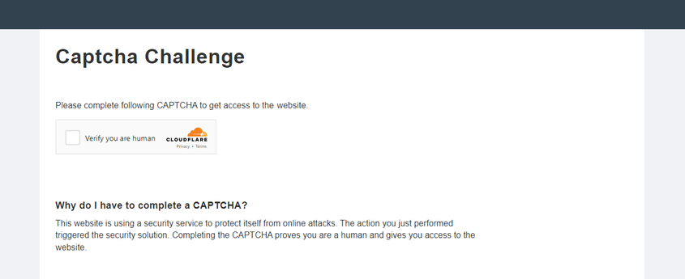
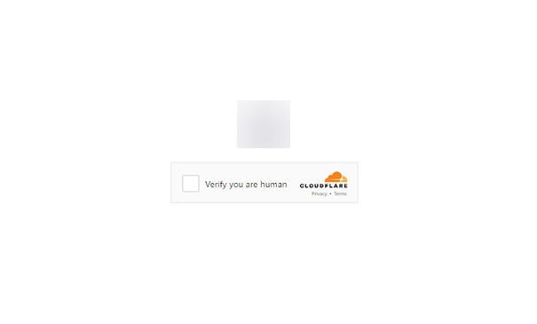
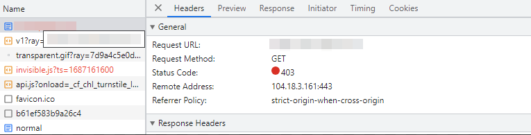
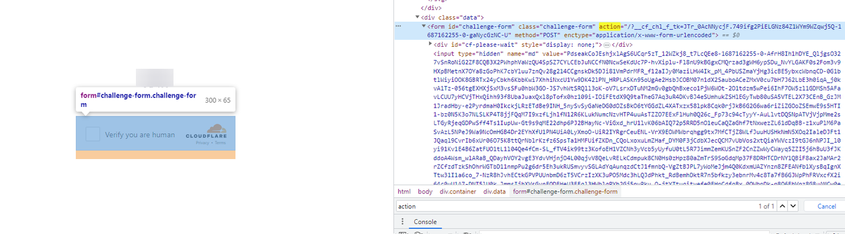
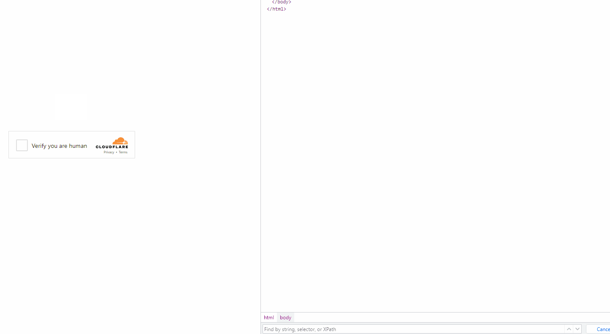

import Tabs from '@theme/Tabs';
import TabItem from '@theme/TabItem';
import ParamItem from '@theme/ParamItem';
import MethodItem from '@theme/MethodItem';
import MethodDescription from '@theme/MethodDescription'
import PriceBlock from '../../../../../src/theme/PriceBlock'
import PriceBlockWrap from '@theme/PriceBlockWrap';
import BlogLink from '@theme/BlogLink';
import { ArticleHead } from '../../../../../src/theme/ArticleHead';

<ArticleHead slug="captchas/turnstile-challenge-task" />

# Cloudflare Challenge

<PriceBlockWrap>
  <PriceBlock title="Cloudflare Challenge" captchaId="cf-turnstile"/>
</PriceBlockWrap>


<BlogLink url="https://capmonster.cloud/zh/blog/Cloudflare/what-is-cloudflare-captcha"/>
<BlogLink url="https://capmonster.cloud/zh/blog/Cloudflare/how-cloudflare-bot-challenge-and-turnstile-protect-web-traffic"/>

:::info 重要提示：
CapMonster Cloud 可以返回解决方案结果为 **token** 或 **cf_clearance cookie**。在开始之前，请先了解这两种选项，并选择最适合您使用场景的方式。
:::

## 请求参数

### 选项 1. Challenge（token）

:::warning 注意！

* CapMonster Cloud 默认使用内置代理 —— 费用已包含在服务中。仅在网站不接受 token 或访问内置服务受限时，才需要指定自己的代理。

* 如果您使用 IP 授权的代理，请确保将地址 **65.21.190.34** 列入白名单。

* 完成验证后，您将收到一个 **token** 用于确认验证码已完成。
  :::

<TabItem value="proxyless" label="RecaptchaV2EnterpriseTaskProxyless（无代理）" default className="bordered-panel">
  <ParamItem title="type" required type="string" />
  **TurnstileTask**

---

  <ParamItem title="websiteURL" required type="string" />
  需要解验证码的页面 URL

---

  <ParamItem title="websiteKey" required type="string" />
  Turnstile 网站 key

---

  <ParamItem title="cloudflareTaskType" required type="string" />
  **token**

---

  <ParamItem title="pageAction" required type="string" />
  在回调函数中找到的 `action` 字段。如果使用 *cloudflareTaskType*，`action` 通常是 “managed” 或 “non-interactive”。

---

  <ParamItem title="userAgent" required type="string" />
  浏览器 User-Agent。  
  **请仅传递来自 Windows 系统的有效 UA。目前值为**: `userAgentPlaceholder`

---

  <ParamItem title="data" required type="string" />
  *data* 字段的值，从 `cData` 获取

---

<ParamItem title="pageData" required type="string" />
  *pageData* 的值，从 `chlPageData` 获取

---

  <ParamItem title="apiJsUrl" type="string" />
  包含验证码脚本 URL 的字符串

---

  <ParamItem title="proxyType" type="string" />
  **http** - 标准 http/https 代理；<br />
  **https** - 如果 "http" 不工作可尝试此类型（某些自定义代理需要）；<br />
  **socks4** - socks4 代理；<br />
  **socks5** - socks5 代理

---

  <ParamItem title="proxyAddress" type="string" />
  <p>
    代理的 IP 地址 (IPv4/IPv6)。禁止：
    - 使用透明代理（会暴露客户端 IP）；
    - 使用本机代理。
  </p>

---

  <ParamItem title="proxyPort" type="integer" />
  代理端口

---

  <ParamItem title="proxyLogin" type="string" />
  代理登录名

---

  <ParamItem title="proxyPassword" type="string" />
  代理密码

</TabItem>

<br />

这些参数在创建验证码时传给 `window.turnstile.render(el, paramsObj)` 的对象中。你可以通过在加载其他脚本之前执行 JavaScript 来获取它们，例如：

```js
(function () {
  const obj = {
    render: function () {
      const { action, cData, chlPageData } = arguments[1];
        const params = [
          ["action", action],
          ["data", cData],
          ["pageData", chlPageData],
        ];
        console.table(params)
    }
  };

  Object.defineProperty(window, "turnstile", {
    get: () => {
      return obj;
    },
  });
})();
```

当 `window.turnstile.render(el, paramsObj)` 被调用时，验证码会加载到页面上，成功完成后，`callback` 函数会传递解决方案信息。

`window.turnstile.render(el, paramsObj):`

* `el`：插入验证码的 DOM 元素
* `paramsObj`：包含验证码信息和解决指令的对象，通常包括 *sitekey*、*action*、*cData*、*chlPageData*、*callback*
* `callback`：验证码成功解决后调用的函数

---
## 选项 2. Challenge（cookie）

:::warning **注意！**

* 本任务必须使用 **自有代理**。

* 完成后，你将收到 **特殊的 cookie**，需添加到浏览器中。
  :::

<TabItem value="proxyless" label="RecaptchaV2EnterpriseTaskProxyless（无代理）" default className="bordered-panel">
  <ParamItem title="type" required type="string" />
  **TurnstileTask**

---

  <ParamItem title="websiteURL" required type="string" />
  验证码所在页面的 URL

---

  <ParamItem title="websiteKey" required type="string" />
  Turnstile 网站 key（可使用任意字符串）

---

  <ParamItem title="cloudflareTaskType" required type="string" />
  **cf_clearance**

---

  <ParamItem title="htmlPageBase64" required type="string" />
  Base64 编码的 HTML 页面，显示 403 响应时的 “Just a moment” 页面。<br/>
  获取 `htmlPageBase64` 示例：
  ```js
  var htmlContent = document.documentElement.outerHTML;
  var htmlBase64 = btoa(unescape(encodeURIComponent(htmlContent)));
  console.log(htmlBase64);
  ```

---

  <ParamItem title="userAgent" required type="string" />
  浏览器 User-Agent。<br />
  **仅提供当前 Windows UA：** userAgentPlaceholder

---

  <ParamItem title="proxyType" required type="string" />
  **http** - 常规 HTTP/HTTPS 代理；<br />
  **https** - 如果 http 不可用使用（某些自定义代理需要）；<br />
  **socks4** - SOCKS4 代理；<br />
  **socks5** - SOCKS5 代理

---

  <ParamItem title="proxyAddress" required type="string" />
  <p>
    代理 IP 地址 (IPv4/IPv6)。禁止：
    - 透明代理
    - 本机代理
  </p>

---

  <ParamItem title="proxyPort" required type="integer" />
  代理端口

---

  <ParamItem title="proxyLogin" required type="string" />
  代理登录名

---

  <ParamItem title="proxyPassword" required type="string" />
  代理密码

</TabItem>

---
## 创建任务方法

### 选项 1. Challenge（token）

<Tabs className="full-width-tabs filled-tabs request-tabs" groupId="captcha-type">

  <TabItem value="proxyless" label="TurnstileTask（无代理）" default className="method-panel">
    <MethodItem>
      ```http
      https://api.capmonster.cloud/createTask
      ```
    </MethodItem>
    <MethodDescription>
      **请求**
      ```json
      {
        "clientKey": "API_KEY",
        "task": {
          "type": "TurnstileTask",
          "websiteURL": "https://example.com",
          "websiteKey": "0x4AAAAAAADnPIDROrmt1Wwj",
          "cloudflareTaskType": "token",
          "userAgent": "userAgentPlaceholder",
          "pageAction": "managed",
          "pageData": "HUHDWUHuhuwfiweh32..uh2uhuhyugYUG=",
          "data": "874291f4retD1366"
        }
      }
      ```

  **响应**
  ```json
  {
    "errorId": 0,
    "taskId": 407533072
  }
  ```
</MethodDescription>

  </TabItem>

  <TabItem value="proxy" label="TurnstileTask（使用代理）" className="method-panel">
    <MethodItem>
      ```http
      https://api.capmonster.cloud/createTask
      ```
    </MethodItem>
    <MethodDescription>
      **请求**
      ```json
      {
        "clientKey": "API_KEY",
        "task": {
          "type": "TurnstileTask",
          "websiteURL": "https://example.com",
          "websiteKey": "0x4AAAAAAADnPIDROrmt1Wwj",
          "cloudflareTaskType": "token",
          "userAgent": "userAgentPlaceholder",
          "pageAction": "managed",
          "pageData": "HUHDWUHuhuwfiweh32..uh2uhuhyugYUG=",
          "data": "874291f4retD1366",
          "proxyType": "http",
          "proxyAddress": "8.8.8.8",
          "proxyPort": 8080,
          "proxyLogin": "proxyLoginHere",
          "proxyPassword": "proxyPasswordHere"
        }
      }
      ```

  **响应**
  ```json
  {
    "errorId": 0,
    "taskId": 407533072
  }
  ```
</MethodDescription>

  </TabItem>

</Tabs>

---

### 选项 2. Challenge（cookie）

<TabItem value="proxyless" label="TurnstileTask（无代理）" default className="method-panel">
	<MethodItem>
		```http
		https://api.capmonster.cloud/createTask
		```
	</MethodItem>
	<MethodDescription>
		**请求**
		```json 
		{
		  "clientKey":"API_KEY",
		  "task": {
			"type":"TurnstileTask",
			"websiteURL":"https://example.com",
			"websiteKey":"xxxxxxxxxx",
			"cloudflareTaskType": "cf_clearance",
			"htmlPageBase64": "PCFET0NUWVBFIGh0...vYm9keT48L2h0bWw+",
			"userAgent": "userAgentPlaceholder",
			"proxyType":"http",
			"proxyAddress":"8.8.8.8",
			"proxyPort":8080,
			"proxyLogin":"proxyLoginHere",
			"proxyPassword":"proxyPasswordHere"
		  }
		}
		```
		**响应**
		```json
		{
		  "errorId":0,
		  "taskId":407533072
		}
		```
	</MethodDescription>
</TabItem>
---
## 获取任务结果方法

### 选项 1. Challenge（token）

<TabItem value="proxyless" label="TurnstileTask（无代理）" default className="method-panel-full">
  <MethodItem>
    ```http
    https://api.capmonster.cloud/getTaskResult
    ```
  </MethodItem>
  <MethodDescription>
    **请求**
    ```json
    {
      "clientKey": "API_KEY",
      "taskId": 407533072
    }
    ```

**响应**
```json
{
  "errorId": 0,
  "status": "ready",
  "solution": {
    "userAgent": "userAgentPlaceholder",
    "token": "0.iGX3xsyFCkbGePM3jP4P4khLo6TrLukt8ZzBvwuQOvbC...f61f3082"
  }
}
```

  </MethodDescription>
</TabItem>

使用 [getTaskResult](../api/methods/get-task-result.mdx) 方法来获取 Challenge 的解决方案。根据系统负载，响应时间可能在 5 到 20 秒之间。

| **属性** | **类型** | **说明**            |
| :----- | :----- | :---------------- |
| token  | String | 在调用回调函数时使用此 token |

### 选项 2. Challenge（cookie）

<TabItem value="proxyless" label="TurnstileTask（无代理）" default className="method-panel-full">
  <MethodItem>
    ```http
    https://api.capmonster.cloud/getTaskResult
    ```
  </MethodItem>
  <MethodDescription>
    **请求**
    ```json
    {
      "clientKey": "API_KEY",
      "taskId": 407533072
    }
    ```
    
**响应**
```json
{
  "errorId": 0,
  "status": "ready",
  "solution": {
    "cf_clearance": "1tarGvbY2_ZhQdYxpSBloao.FoOn9VtcJtmb_IQ_hCE-1761217338-1.2.1.1-vyVPoLYIGX0VCJomVuLjF7n0kdM0PXaPjpDsRcohxGr7hb2CE7WfcHpmQZ70goqEjdWxPsDhSVaKNTz9opxWguiNdWEEq_.SceWXIqfP7tnEb69f3bP0mixNqcWy_5P_9INpoAEqr1k7aYU0r45PT4gPr5pwHxedVySyLRdoBXIJasdTE52YOQ3NPdGWTwQ_3h2n_wYqqIvf0kCSAvimRrmsgZxomlyejwqPI6ZHi.w"
  }
}
```

  </MethodDescription>
</TabItem>

| **属性**       | **类型** | **说明**                         |
| :----------- | :----- | :----------------------------- |
| cf_clearance | String | 特殊的 Cloudflare cookie，可在浏览器中设置 |

---

## 如何区分 Challenge 与 Turnstile

<details>
  <summary>Challenge 与 Turnstile 的区别</summary>

Cloudflare 的验证类型可能会以不同形式出现。

**标准 Turnstile：**


**样式化变体：**

<figure>



<figcaption>验证无缝集成到网站中</figcaption>

</figure>

<figure>



<figcaption>看起来像普通 Turnstile 验证，但实际上是 Cloudflare Challenge</figcaption>

</figure>

要确认是否为 Challenge，可以打开开发者工具，检查网络流量，并查看页面源码中的典型标志：

* 第一次请求站点时返回 403 状态码：



* id 为 **challenge-form** 的表单，其 **action** 属性（不要与 Turnstile 的 action 混淆）包含参数 `__cf_chl_f_tk=`：



* 页面包含两个类似的 `<script>` 标签，在 `window` 对象中创建新的值：



</details>

---
## 如何获取创建任务所需的所有参数

### 自动化获取

要自动提取参数，可以通过 **浏览器**（普通或无头，例如使用 **Playwright**）或直接从 **HTTP 请求** 获取。由于动态参数有效期较短，建议在获取后立即使用。

:::warning **重要提示！**
提供的代码片段仅作为学习如何提取所需参数的基础示例。具体实现将取决于你的验证码页面、页面结构以及使用的 HTML 元素和选择器。
:::

<Tabs className="full-width-tabs filled-tabs request-tabs">
  <TabItem value="js" label="JavaScript" default className="method-panel">

<details>
  <summary>选项 1：Challenge（token）– Node.js</summary>

  ```js
  import { chromium } from "playwright";

  (async () => {
    const browser = await chromium.launch({ headless: false });
    const page = await browser.newPage();

    let params = null;

    try {
      while (!params) {
        await page.goto("https://example.com");

        await page.evaluate(() => {
          window.turnstile = new Proxy(window.turnstile, {
            get(target, prop) {
              if (prop === "render") {
                return function (a, b) {
                  const p = {
                    websiteKey: b.sitekey,
                    websiteURL: window.location.href,
                    data: b.cData,
                    pagedata: b.chlPageData,
                    action: b.action,
                    userAgent: navigator.userAgent,
                  };
                  window.params = p;
                  return target.render.apply(this, arguments);
                };
              }
              return target[prop];
            },
          });
        });

        params = await page.evaluate(() => {
          return new Promise((resolve) => {
            setTimeout(() => resolve(window.params || null), 5000);
          });
        });

        if (!params) {
          await page.waitForTimeout(3000);
        }
      }

      console.log("Turnstile Params:", params);
    } finally {
      await browser.close();
    }
  })();
  ```
</details>

<details>
      <summary>选项 2：Challenge（cookie `cf_clearance`）– Node.js</summary>

  ```js
  import { chromium } from "playwright";
  import { Buffer } from "buffer";

  (async () => {
    const browser = await chromium.launch({ headless: false });
    const page = await browser.newPage();

    let websiteKey = null;

    while (!websiteKey) {
      await page.goto("https://example.com");

      await page.evaluate(() => {
        window.turnstile = new Proxy(window.turnstile, {
          get(target, prop) {
            if (prop === "render") {
              return function (a, b) {
                // 保存 sitekey 到全局变量
                window.websiteKey = b.sitekey;
                return target.render.apply(this, arguments);
              };
            }
            return target[prop];
          },
        });
      });

      websiteKey = await page.evaluate(() => {
        return new Promise((resolve) => {
          setTimeout(() => resolve(window.websiteKey || null), 5000);
        });
      });

      if (!websiteKey) {
        await page.waitForTimeout(3000);
      }
    }

    // 获取页面 HTML 并转换为 Base64
    const html = await page.content();
    const htmlPageBase64 = Buffer.from(html).toString("base64");

    const result = {
      websiteKey,
      htmlPageBase64,
    };

    console.log(result);

    await browser.close();
  })();
  ```
</details>

  </TabItem>

<TabItem value="python" label="Python" className="method-panel">

<details>
  <summary>选项 1：Challenge（token）</summary>

  ```python
  import asyncio
  from playwright.async_api import async_playwright

  async def extract_turnstile_params():
      async with async_playwright() as p:
          browser = await p.chromium.launch(headless=False)
          page = await browser.new_page()

          params = None

          while not params:
              await page.goto("https://example.com")

              await page.evaluate("""
                  window.turnstile = new Proxy(window.turnstile, {
                    get(target, prop) {
                      if prop === "render":
                        # 保存参数到全局变量
                        return function(a, b) {
                          const p = {
                            websiteKey: b.sitekey,
                            websiteURL: window.location.href,
                            data: b.cData,
                            pagedata: b.chlPageData,
                            action: b.action,
                            userAgent: navigator.userAgent
                          };
                          window.params = p;
                          return target.render.apply(this, arguments);
                        };
                      return target[prop];
                    }
                  });
              """)

              await page.wait_for_timeout(5000)

              params = await page.evaluate("window.params || null")

              if not params:
                  await page.wait_for_timeout(3000)

          print("Turnstile Params:", params)

          await browser.close()

  asyncio.run(extract_turnstile_params())
  ```
</details>

<details>
  <summary>选项 2：Challenge（cookie `cf_clearance`）</summary>

  ```python
  import asyncio
  import base64
  from playwright.async_api import async_playwright

  async def main():
      async with async_playwright() as p:
          browser = await p.chromium.launch(headless=False)
          page = await browser.new_page()

          website_key = None

          while not website_key:
              await page.goto("https://example.com")

              await page.evaluate("""
                  () => {
                      # 拦截 window.turnstile.render 调用以提取 sitekey
                      window.turnstile = new Proxy(window.turnstile, {
                          get(target, prop) {
                              if prop === 'render':
                                  return function(a, b) {
                                      window.websiteKey = b.sitekey;
                                      return target.render.apply(this, arguments);
                                  };
                              return target[prop];
                          }
                      });
                  }
              """)

              website_key = await page.evaluate("""
                  () => new Promise(resolve => {
                      setTimeout(() => resolve(window.websiteKey || null), 5000);
                  })
              """)

              if not website_key:
                  await page.wait_for_timeout(3000)

          # 获取页面 HTML 并编码为 Base64
          html = await page.content()
          html_base64 = base64.b64encode(html.encode("utf-8")).decode("utf-8")

          result = {
              "websiteKey": website_key,
              "htmlPageBase64": html_base64
          }

          print(result)

          await browser.close()

  asyncio.run(main())
  ```
</details>
  </TabItem>

<TabItem value="csharp" label="C#" className="method-panel">

<details>
  <summary>选项 1：Challenge（token）</summary>

  ```csharp
  using Microsoft.Playwright;
  using System.Text.Json;

  class Program
  {
      public static async Task Main()
      {
          using var playwright = await Playwright.CreateAsync();
          var browser = await playwright.Chromium.LaunchAsync(new BrowserTypeLaunchOptions
          {
              Headless = false
          });

          var page = await browser.NewPageAsync();
          object? parameters = null;

          while (parameters == null)
          {
              await page.GotoAsync("https://example.com");

              await page.EvaluateAsync(@"() => {
                  // 拦截 window.turnstile.render 调用以提取参数
                  window.turnstile = new Proxy(window.turnstile, {
                      get(target, prop) {
                          if (prop === 'render') {
                              return function(a, b) {
                                  const p = {
                                      websiteKey: b.sitekey,
                                      websiteURL: window.location.href,
                                      data: b.cData,
                                      pagedata: b.chlPageData,
                                      action: b.action,
                                      userAgent: navigator.userAgent
                                  };
                                  window.params = p;
                                  return target.render.apply(this, arguments);
                              };
                          }
                          return target[prop];
                      }
                  });
              }");

              parameters = await page.EvaluateAsync(@"() => new Promise(resolve => {
                  setTimeout(() => resolve(window.params || null), 5000);
              })");

              if (parameters == null)
              {
                  await page.WaitForTimeoutAsync(3000);
              }
          }

          Console.WriteLine("Turnstile Params:");
          Console.WriteLine(JsonSerializer.Serialize(parameters, new JsonSerializerOptions { WriteIndented = true }));

          await browser.CloseAsync();
      }
  }
  ```
</details>

<details>
  <summary>选项 2：Challenge（cookie `cf_clearance`）</summary>

  ```csharp
  using System;
  using System.Text;
  using System.Threading.Tasks;
  using Microsoft.Playwright;

  class Program
  {
      public static async Task Main()
      {
          using var playwright = await Playwright.CreateAsync();
          var browser = await playwright.Chromium.LaunchAsync(
            new BrowserTypeLaunchOptions { Headless = false });
          var page = await browser.NewPageAsync();

          string websiteKey = null;

          while (websiteKey == null)
          {
              await page.GotoAsync("https://example.com");

              await page.EvaluateAsync(@"() => {
                  // 拦截 window.turnstile.render 调用以提取 websiteKey
                  window.turnstile = new Proxy(window.turnstile, {
                      get(target, prop) {
                          if (prop === 'render') {
                              return function(a, b) {
                                  window.websiteKey = b.sitekey;
                                  return target.render.apply(this, arguments);
                              };
                          }
                          return target[prop];
                      }
                  });
              }");

              websiteKey = await page.EvaluateAsync<string>(@"() => 
              new Promise(resolve => {
                  setTimeout(() => resolve(window.websiteKey || null), 5000);
              })");

              if (websiteKey == null)
              {
                  await page.WaitForTimeoutAsync(3000);
              }
          }

          // 将 HTML 页面内容编码为 Base64
          var html = await page.ContentAsync();
          var htmlBase64 = Convert.ToBase64String(Encoding.UTF8.GetBytes(html));

          Console.WriteLine($"websiteKey: {websiteKey}");
          Console.WriteLine($"htmlPageBase64: {htmlBase64}");

          await browser.CloseAsync();
      }
  }
  ```
    </details>
  </TabItem>
</Tabs>

当然，这里是将你的说明文本翻译成中文，但代码保持不变：


## 使用 Selenium 在 Node.js 中实现解决方案的示例

<details>
  <summary>显示代码</summary>

```js

const { Builder } = require('selenium-webdriver');
const chrome = require('selenium-webdriver/chrome');

(async function example() {
  const options = new chrome.Options();
  options.addArguments('--auto-open-devtools-for-tabs')

  const driver = new Builder()
    .forBrowser('chrome')
    .setChromeOptions(options)
    .build();

  try {
    driver.executeScript(`
    window.turnstile = new Proxy(window.turnstile, {
      get(target, prop) {
        if (prop === 'render') {
          return function(a, b) {
            let p = {
              type: "TurnstileTask",
              websiteKey: b.sitekey,
              websiteURL: window.location.href,
              data: b.cData,
              pagedata: b.chlPageData,
              action: b.action,
              userAgent: navigator.userAgent
          }
          
          console.log(JSON.stringify(p))
          window.params = p;
          window.turnstileCallback = b.callback;
            return target.render.apply(this, arguments);
          }
        }
        return target[prop];
      }
    });
    `)

    driver.get('SITE WITH CAPTCHA');
    

    const params = await driver.executeScript(`
      return new Promise((resolve, reject) => {
        setTimeout(() => {
          resolve(window.params)
        }, 2000)
      })
    `);

    if (params) {
      const data = {
        clientKey: 'API KEY',
        task: {
          type: 'TurnstileTask',
          websiteURL: params.websiteURL,
          websiteKey: params.websiteKey,
          data: params.data,
          action: params.action
        }
      }

      const createResult = await fetch('https://api.capmonster.cloud/createTask', {
        method: 'post',
        body: JSON.stringify(data)
      });

      const createTaskResult = await createResult.json()

      if (createTaskResult.taskId) {
        const asyncDelay = (timeout) =>
          new Promise(resolve => {
              setTimeout(() => {
                  resolve();
              }, timeout);
          });
        
        const getTaskResult = async (taskId) => {
          const taskResult = await fetch('https://api.capmonster.cloud/getTaskResult', {
            method: 'post',
            body: JSON.stringify({
              "clientKey":"API KEY",
              "taskId": createTaskResult.taskId
            })
          });
          const taskResponse = await taskResult.json();
          if (taskResponse.status === 'processing') {
            await asyncDelay(5000);
            return await getTaskResult(taskId)
          }
          return taskResponse;
        }
       
        const taskRes = await getTaskResult(createTaskResult.taskId)

        if (taskRes.solution) {
          await driver.executeScript(`
            window.turnstileCallback(${taskRes.solution.token});
          `);
        }
      }
      
    }

    //执行某些操作
  } finally {
    await driver.quit();
  }
})();

```
</details>

---

## 使用 SDK 库

<Tabs className="full-width-tabs filled-tabs request-tabs" groupId="captcha-type">
  <TabItem value="js" label="JavaScript" default className="method-panel">

<details>
<summary>选项 1. Challenge（令牌）</summary>

```js
// https://github.com/ZennoLab/capmonstercloud-client-js

import { 
    CapMonsterCloudClientFactory, 
    ClientOptions, 
    TurnstileRequest 
} from '@zennolab_com/capmonstercloud-client';

const API_KEY = "YOUR_API_KEY"; // 输入您的 CapMonster Cloud API 密钥

document.addEventListener("DOMContentLoaded", async () => {
    const client = CapMonsterCloudClientFactory.Create(
        new ClientOptions({ clientKey: API_KEY })
    );

    // 基本示例，无需代理
    // CapMonster Cloud 会自动使用它们的代理
    let turnstileRequest = new TurnstileRequest({
        websiteURL: "https://example.com", // 验证码页面的 URL
        websiteKey: "0x4AAAAAAABUYP0XeMJF0xoy", // 替换为正确的值
        data: "YOUR_DATA_HERE",
        pageAction: "managed",
        cloudflareTaskType: "token",
        pageData: "YOUR_PAGE_DATA_HERE",
        userAgent: "userAgentPlaceholder"
    });

    // 使用您自己的代理的示例
    // 如果想使用自己的代理，请取消注释以下代码块

    /*
    const proxy = {
        proxyType: "http",
        proxyAddress: "123.45.67.89",
        proxyPort: 8080,
        proxyLogin: "username",
        proxyPassword: "password"
    };

    turnstileRequest = new TurnstileRequest({
        websiteURL: "https://example.com",
        websiteKey: "0x4AAAAAAABUYP0XeMJF0xoy",
        proxy,
        data: "YOUR_DATA_HERE",
        pageAction: "managed",
        cloudflareTaskType: "token",
        pageData: "YOUR_PAGE_DATA_HERE",
        userAgent: "userAgentPlaceholder"
    });
    */

    // 如有必要，可以检查余额 
    const balance = await client.getBalance();
    console.log("Balance:", balance);

    const result = await client.Solve(turnstileRequest);
    console.log("Solution:", result);
});
```
</details>

<details>
<summary>选项 2. Challenge（Cookie `cf_clearance`）</summary>

```js
// https://github.com/ZennoLab/capmonstercloud-client-js

import { 
    CapMonsterCloudClientFactory, 
    ClientOptions, 
    TurnstileRequest 
} from '@zennolab_com/capmonstercloud-client';

document.addEventListener("DOMContentLoaded", async () => {
    const cmcClient = CapMonsterCloudClientFactory.Create(
        new ClientOptions({ clientKey: 'YOUR_API_KEY' }) // 输入您的 CapMonster Cloud API 密钥
    );

    // 如有必要，可以检查余额
    const balance = await cmcClient.getBalance();
    console.log('Balance:', balance);

    const proxy = {
        proxyType: "http",
        proxyAddress: '123.45.67.89',
        proxyPort: 8080,
        proxyLogin: 'username',
        proxyPassword: 'password'
    };

    // Cloudflare cf_clearance 只能使用您的代理解决
    const turnstileRequest = new TurnstileRequest({
        websiteURL: 'https://example.com/',
        websiteKey: '0x4AAAAAAABUY0VLtOUMAHxE',
        cloudflareTaskType: 'cf_clearance',
        proxy,
        htmlPageBase64: 'PGh0bW...h0bWw+',
        userAgent: 'userAgentPlaceholder'
    });

    // 发送验证码解决任务
    const result = await cmcClient.Solve(turnstileRequest);
    console.log('Solution:', result.solution);
});
```

</details>
</TabItem>

<TabItem value="nodejs" label="Node.js" className="method-panel">

<details>
<summary>选项 1. Challenge（令牌）</summary>
```js
// https://github.com/ZennoLab/capmonstercloud-client-js

import { 
    CapMonsterCloudClientFactory, 
    ClientOptions, 
    TurnstileRequest 
} from '@zennolab_com/capmonstercloud-client';

const API_KEY = "YOUR_API_KEY"; // 输入您的 CapMonster Cloud API 密钥

(async () => {
    const client = CapMonsterCloudClientFactory.Create(
        new ClientOptions({ clientKey: API_KEY })
    );

    // 基本示例，无需代理
    // CapMonster Cloud 会自动使用它们的代理
    let turnstileRequest = new TurnstileRequest({
        websiteURL: "https://example.com", // 验证码页面的 URL
        websiteKey: "0x4AAAAAAABUYP0XeMJF0xoy", // 替换为正确的值
        data: "YOUR_DATA_HERE",
        pageAction: "managed",
        cloudflareTaskType: "token",
        pageData: "YOUR_PAGE_DATA_HERE",
        userAgent: "userAgentPlaceholder"
    });

    // 使用您自己的代理的示例
    // 如果想使用自己的代理，请取消注释以下代码块

    /*
    const proxy = {
        proxyType: "http",
        proxyAddress: "123.45.67.89",
        proxyPort: 8080,
        proxyLogin: "username",
        proxyPassword: "password"
    };

    turnstileRequest = new TurnstileRequest({
        websiteURL: "https://example.com",
        websiteKey: "0x4AAAAAAABUYP0XeMJF0xoy",
        proxy,
        data: "YOUR_DATA_HERE",
        pageAction: "managed",
        cloudflareTaskType: "token",
        pageData: "YOUR_PAGE_DATA_HERE",
        userAgent: "userAgentPlaceholder"
    });
    */

    // 如有必要，可以检查余额 
    const balance = await client.getBalance();
    console.log("Balance:", balance);

    const result = await client.Solve(turnstileRequest);
    console.log("Solution:", result);
})();

```
</details>

<details>
<summary>选项 2. Challenge（Cookie <code>cf_clearance</code>）</summary>

```js
// https://github.com/ZennoLab/capmonstercloud-client-js

import { CapMonsterCloudClientFactory, ClientOptions, TurnstileRequest } from '@zennolab_com/capmonstercloud-client';

async function main() {
    const cmcClient = CapMonsterCloudClientFactory.Create(
        new ClientOptions({ clientKey: 'YOUR_API_KEY' }) // 输入您的 CapMonster Cloud API 密钥
    );

    // 如有必要，可以检查余额
    const balance = await cmcClient.getBalance();
    console.log('Balance:', balance);

    const proxy = {
        proxyType: "http",
        proxyAddress: '123.45.67.89',
        proxyPort: 8080,
        proxyLogin: 'username',
        proxyPassword: 'password'
    };

    // Cloudflare cf_clearance 只能使用您的代理解决
    const turnstileRequest = new TurnstileRequest({
        websiteURL: 'https://example.com/',
        websiteKey: '0x4AAAAAAABUY0VLtOUMAHxE',
        cloudflareTaskType: 'cf_clearance',
        proxy,
        htmlPageBase64: 'PGh0bW...h0bWw+',
        userAgent: 'userAgentPlaceholder'
    });

    // 发送验证码解决任务
    const result = await cmcClient.Solve(turnstileRequest);
    console.log('Solution:', result.solution);
}

main().catch(console.error);
```

</details>

</TabItem>

  <TabItem value="python" label="Python" className="method-panel">

<details>
<summary>选项 1. Challenge（令牌）</summary>

```python
# https://github.com/ZennoLab/capmonstercloud-client-python

import asyncio
from capmonstercloudclient import CapMonsterClient, ClientOptions
from capmonstercloudclient.requests import TurnstileRequest
# from capmonstercloudclient.requests.baseRequestWithProxy import ProxyInfo  # 如果计划使用代理，请取消注释

API_KEY = "YOUR_API_KEY"  # 输入您的 CapMonster Cloud API 密钥

async def solve_turnstile_token():
    client_options = ClientOptions(api_key=API_KEY)
    cap_monster_client = CapMonsterClient(options=client_options)

    # 基本示例，无需代理
    # CapMonster Cloud 会自动使用它们的代理
    turnstile_request = TurnstileRequest(
        websiteURL="http://example.com",  # 验证码页面的 URL
        websiteKey="0x4AAAAAAABUYP0XeMJF0xoy",        # 替换为正确的值
        data="YOUR_DATA_HERE",
        pageAction="managed",
        cloudflareTaskType="token",
        pageData="YOUR_PAGE_DATA_HERE",
        userAgent="userAgentPlaceholder"
    )

    # 使用您自己的代理的示例
    # 如果想使用自己的代理，请取消注释以下代码块
    #
    # proxy = ProxyInfo(
    #     proxyType="http",               
    #     proxyAddress="123.45.67.89",    
    #     proxyPort=8080,                 
    #     proxyLogin="username",          
    #     proxyPassword="password"        
    # )
    #
    # turnstile_request = TurnstileRequest(
    #     websiteURL="http://tsmanaged.zlsupport.com",
    #     websiteKey="0x4AAAAAAABUYP0XeMJF0xoy",
    #     proxy=proxy,
    #     data="YOUR_DATA_HERE",
    #     pageAction="managed",
    #     cloudflareTaskType="token",
    #     pageData="YOUR_PAGE_DATA_HERE",
    #     userAgent="userAgentPlaceholder"
    # )

    # 如有必要，可以检查余额 
    balance = await cap_monster_client.get_balance()
    print("Balance:", balance)

    result = await cap_monster_client.solve_captcha(turnstile_request)
    print("Solution:", result)

asyncio.run(solve_turnstile_token())
```

</details>

<details>
<summary>选项 2. Challenge（Cookie `cf_clearance`）</summary>

```python
# https://github.com/ZennoLab/capmonstercloud-client-python

import asyncio
from capmonstercloudclient import CapMonsterClient, ClientOptions
from capmonstercloudclient.requests import TurnstileRequest
from capmonstercloudclient.requests.baseRequestWithProxy import ProxyInfo  # 使用 ProxyInfo

API_KEY = "YOUR_API_KEY"  # 输入您的 CapMonster Cloud API 密钥

async def solve_cf_clearance():
    client_options = ClientOptions(api_key=API_KEY)
    cap_monster_client = CapMonsterClient(options=client_options)

    # 代理设置示例
    proxy = ProxyInfo(
        proxyType="http",
        proxyAddress="123.45.67.89",
        proxyPort=8080,
        proxyLogin="username",
        proxyPassword="password"
    )

    # Cloudflare cf_clearance 只能使用您的代理解决
    turnstile_request = TurnstileRequest(
        websiteURL="https://example.com",
        websiteKey="0x4AAAAAAABUYP0XeMJF0xoy",
        cloudflareTaskType="cf_clearance",
        htmlPageBase64="BASE64_HTML_PAGE_HERE",
        userAgent="userAgentPlaceholder",
        proxy=proxy
    )

    # 如有必要，可以检查余额
    balance = await cap_monster_client.get_balance()
    print("Balance:", balance)

    # 发送验证码解决任务
    result = await cap_monster_client.solve_captcha(turnstile_request)
    print("Solution:", result)

asyncio.run(solve_cf_clearance())
```

</details>
  </TabItem>

  <TabItem value="csharp" label="C#" className="method-panel">

<details>
<summary>选项 1. Challenge（令牌）</summary>

```csharp
// https://github.com/ZennoLab/capmonstercloud-client-dotnet

using System;
using System.Threading.Tasks;
using Zennolab.CapMonsterCloud;
using Zennolab.CapMonsterCloud.Requests;

class Program
{
    static async Task Main(string[] args)
    {
        // 您的 CapMonster Cloud API 密钥
        var clientOptions = new ClientOptions
        {
            ClientKey = "YOUR_API_KEY"
        };

        var cmCloudClient = CapMonsterCloudClientFactory.Create(clientOptions);

        // 基本示例，无需代理
        // CapMonster Cloud 会自动使用它们的代理
        var turnstileRequest = new TurnstileRequest
        {
            WebsiteUrl = "https://example.com",        // 验证码页面的 URL
            WebsiteKey = "0x4AAAAAAABUYP0XeMJF0xoy",    // 替换为正确的值
            Data = "data_here",
            PageAction = "managed",
            CloudflareTaskType = "token",
            PageData = "pagedata_here",
            UserAgent = "userAgentPlaceholder"
        };

        // 使用您自己的代理的示例
        // 如果想使用自己的代理，请取消注释以下代码块

        /*
        var turnstileRequest = new TurnstileRequest
        {
            WebsiteUrl = "https://example.com",
            WebsiteKey = "0x4AAAAAAABUYP0XeMJF0xoy",
            Data = "data_here",
            PageAction = "managed",
            CloudflareTaskType = "token",
            PageData = "pagedata_here",
            UserAgent = "userAgentPlaceholder",

            Proxy = new ProxyContainer(
                "123.45.67.89",      
                8080,              
                ProxyType.Http,   
                "username", 
                "password"  
            )
        };
        */

        // 如有必要，可以检查余额 
        var balance = await cmCloudClient.GetBalanceAsync();
        Console.WriteLine("Balance: " + balance);

        var turnstileResult = await cmCloudClient.SolveAsync(turnstileRequest);

        Console.WriteLine("Solution: " + turnstileResult.Solution.Value);
    }
}
```

</details>

<details>
<summary>选项 2. Challenge（Cookie `cf_clearance`）</summary>

```csharp
// https://github.com/ZennoLab/capmonstercloud-client-dotnet

using Zennolab.CapMonsterCloud;
using Zennolab.CapMonsterCloud.Requests;

class Program
{
    static async Task Main(string[] args)
    {
        var clientOptions = new ClientOptions
        {
            ClientKey = "YOUR_API_KEY" // 输入您的 CapMonster Cloud API 密钥
        };

        var cmCloudClient = CapMonsterCloudClientFactory.Create(clientOptions);
        
        // Cloudflare cf_clearance 只能使用您的代理解决
        var turnstileRequest = new TurnstileRequest
        {
            WebsiteUrl = "https://example.com",     // 验证码页面的 URL        
            WebsiteKey = "0x4AAAAAAADnPIDROrmt1Wwj",  // 替换为正确的值     
            CloudflareTaskType = "cf_clearance",                                    
            HtmlPageBase64 = "htmlPageBase64Here",        
            UserAgent = "userAgentPlaceholder", 

            Proxy = new ProxyContainer(
                "123.45.67.89", 
                8080,             
                ProxyType.Http,  
                "username",           
                "password"           
            )
        };

        var turnstileResult = await cmCloudClient.SolveAsync(turnstileRequest);

        Console.WriteLine("Solution: " + turnstileResult.Solution.Clearance);
    }
}
```
</details>
  </TabItem>
</Tabs>

