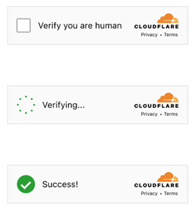
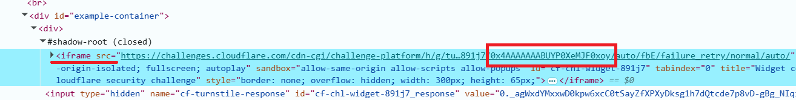

---
sidebar_position: 7
sidebar_label: Cloudflare Turnstile
title: "识别并解决 Cloudflare Turnstile | API"
description: "使用 CapMonster Cloud API 的 Turnstile Task 方法，自动识别并解决 Cloudflare Turnstile 验证码。CapMonster Cloud 文档中提供完整教程和示例。"
---

import Tabs from '@theme/Tabs';
import TabItem from '@theme/TabItem';
import ParamItem from '@theme/ParamItem';
import MethodItem from '@theme/MethodItem';
import MethodDescription from '@theme/MethodDescription'
import PriceBlock from '../../../../../src/theme/PriceBlock'
import PriceBlockWrap from '@theme/PriceBlockWrap';
import BlogLink from '@theme/BlogLink';
import { ArticleHead } from '../../../../../src/theme/ArticleHead';

<ArticleHead slug="captchas/turnstile-task" />

# Cloudflare Turnstile

<PriceBlockWrap>
  <PriceBlock title="Cloudflare Turnstile" captchaId="cf-turnstile"/>
</PriceBlockWrap>



在成功解决 CAPTCHA 之后，您将收到一个 **token**，需要将其插入到页面中指定的字段里。
Turnstile 的所有子类型都会被自动支持：**手动（manual）**、**非交互式（non-interactive）** 和 **不可见（invisible）**。因此，对于标准验证码，您无需指定子类型。

<BlogLink url="https://capmonster.cloud/zh/blog/Cloudflare/what-is-cloudflare-captcha"/>
<BlogLink url="https://capmonster.cloud/zh/blog/Cloudflare/how-cloudflare-bot-challenge-and-turnstile-protect-web-traffic"/>

## 请求参数

您需要解决一个**标准（regular）**的 Turnstile 验证码，例如 [这个示例](https://zenno.link/zl-support)。请注意，Cloudflare 页面上的验证码在外观上可能完全相同。请参阅[如何区分标准 Turnstile 与 Cloudflare Challenge](#如何区分-cloudflare-turnstile-与-cloudflare-challenge)。

:::warning **注意！**

* CapMonster Cloud 默认使用内置代理 —— 其费用已包含在服务价格中。只有在网站不接受返回的 token，或限制访问内置服务时，才需要指定您自己的代理。

* 如果您使用的是 **IP 授权** 的代理，请务必将 **65.21.190.34** 加入白名单。

* 验证成功后，您将获得一个 **token**，用于确认验证码已完成。
  :::

<TabItem value="proxyless" label="TurnstileTask（无代理）" default className="bordered-panel">
  <ParamItem title="type" required type="string" />
  **TurnstileTask**

---

  <ParamItem title="websiteURL" required type="string" />
  进行验证码验证的页面 URL

---

  <ParamItem title="websiteKey" required type="string" />
  Turnstile 的 site key

---

  <ParamItem title="pageAction" type="string" />
  验证码加载时，在回调函数中找到的 `action` 字段

---

  <ParamItem title="data" type="string" />
  *data* 字段的值，来自 `cData` 参数

---

  <ParamItem title="proxyType" type="string" />
  **http** — 标准 http/https 代理；<br />
  **https** — 如果 `http` 不可用可尝试（某些自定义代理需要）；<br />
  **socks4** — socks4 代理；<br />
  **socks5** — socks5 代理。

---

  <ParamItem title="proxyAddress" type="string" />
  <p>
    代理的 IP 地址（IPv4/IPv6）。不允许：
    - 使用透明代理（会暴露客户端真实 IP）；
    - 使用本地机器上的代理。
  </p>

---

  <ParamItem title="proxyPort" type="integer" />
  代理端口。

---

  <ParamItem title="proxyLogin" type="string" />
  代理用户名。

---

  <ParamItem title="proxyPassword" type="string" />
  代理密码。

</TabItem>
---
## 创建任务方法

<Tabs className="full-width-tabs filled-tabs request-tabs" groupId="captcha-type">

  <TabItem value="proxyless" label="TurnstileTask（无代理）" default className="method-panel">
    <MethodItem>
      ```http
      https://api.capmonster.cloud/createTask
      ```
    </MethodItem>
    <MethodDescription>
      **请求**
      ```json
      {
        "clientKey": "API_KEY",
        "task": {
          "type": "TurnstileTask",
          "websiteURL": "http://tsmanaged.zlsupport.com",
          "websiteKey": "0x4AAAAAAABUYP0XeMJF0xoy"
        }
      }
      ```

  **响应**
  ```json
  {
    "errorId": 0,
    "taskId": 407533072
  }
  ```
</MethodDescription>

  </TabItem>

  <TabItem value="proxy" label="TurnstileTask（使用代理）" className="method-panel">
    <MethodItem>
      ```http
      https://api.capmonster.cloud/createTask
      ```
    </MethodItem>
    <MethodDescription>
      **请求**
      ```json
      {
        "clientKey": "API_KEY",
        "task": {
          "type": "TurnstileTask",
          "websiteURL": "http://tsmanaged.zlsupport.com",
          "websiteKey": "0x4AAAAAAABUYP0XeMJF0xoy",
          "proxyType": "http",
          "proxyAddress": "8.8.8.8",
          "proxyPort": 8080,
          "proxyLogin": "proxyLoginHere",
          "proxyPassword": "proxyPasswordHere"
        }
      }
      ```

  **响应**
  ```json
  {
    "errorId": 0,
    "taskId": 407533072
  }
  ```
</MethodDescription>
  </TabItem>

</Tabs>

---

## 获取任务结果方法

使用 [getTaskResult](../api/methods/get-task-result.mdx) 方法来获取 Turnstile 的解决结果。根据系统负载情况，响应时间可能在 **5 到 20 秒**之间。

<TabItem value="proxyless" label="TurnstileTask（无代理）" default className="method-panel-full">
  <MethodItem>
    ```http
    https://api.capmonster.cloud/getTaskResult
    ```
  </MethodItem>
  <MethodDescription>
    **请求**
    ```json
    {
      "clientKey": "API_KEY",
      "taskId": 407533072
    }
    ```

**响应**
```json
{
  "errorId": 0,
  "status": "ready",
  "solution": {
    "userAgent": "userAgentPlaceholder",
    "token": "0.iGX3xsyFCkbGePM3jP4P4khLo6TrLukt8ZzBvwuQOvbC...f61f3082"
  }
}
```

  </MethodDescription>
</TabItem>

| **参数** | **类型** | **说明**                      |
| :----- | :----- | :-------------------------- |
| token  | String | 在输入字段中使用该 token，或在调用回调函数时使用 |

---

## 如何区分 Cloudflare Turnstile 与 Cloudflare Challenge

<details>
  <summary>Turnstile 与 Challenge 的区别</summary>

Cloudflare 的验证类型可能以不同形式呈现。

**标准 Turnstile：**


**样式化变体：**

<figure>


<figcaption>验证流程被无缝集成到网站中</figcaption>

</figure>

<figure>


<figcaption>看起来像普通的 Turnstile 验证，但实际上是 Cloudflare Challenge</figcaption>

</figure>

要确认是否存在 Challenge，请打开开发者工具，检查网络请求，并查看页面源码中是否包含以下典型特征：

* 对网站的第一个请求返回 **403** 状态码：


* ID 为 **challenge-form** 的表单，其 **action** 属性中（不要与 Turnstile 的 action 参数混淆）包含参数 `__cf_chl_f_tk=`：


* 页面中包含两个相似的 `<script>` 标签，这些脚本会在 `window` 对象中创建新的值：


</details>

## 如何查找创建任务所需的所有参数

### 手动方式

1. 在浏览器中打开出现验证码的网站页面。
2. 在验证码元素上点击右键，选择 **检查（Inspect）**。

#### websiteKey

可以在 **Elements（元素）** 面板中找到：




#### pageAction

*action* 和 *sitekey* 也可以在 *callback* 回调函数中找到：


---

### 自动方法

为了自动化获取所需参数，可以通过 **浏览器**（普通模式或 headless 模式，例如使用 **Playwright**）进行提取，或直接从 **HTTP 请求**中获取。由于动态参数的有效时间较短，建议在获取后尽快使用。

:::warning **重要**
所提供的代码片段仅作为获取必要参数的基础示例。具体实现方式取决于包含验证码的网站、本身的页面结构，以及所使用的 HTML 元素和选择器。
:::

<Tabs className="full-width-tabs filled-tabs request-tabs">
  <TabItem value="js" label="JavaScript" default className="method-panel">
    <details>
      <summary>显示代码（浏览器用）</summary>

  ```js
  // 检查 window.onloadTurnstileCallback 是否存在的函数
  const checkTurnstileCallback = () => {
    return new Promise((resolve, reject) => {
      const timeout = setTimeout(() => reject('Callback timeout'), 30000);

      const interval = setInterval(() => {
        if (window.onloadTurnstileCallback !== undefined) {
          clearInterval(interval);
          clearTimeout(timeout);

          const callbackDetails = window.onloadTurnstileCallback.toString();
          const sitekeyMatch = callbackDetails.match(/sitekey: ['"]([^'"]+)['"]/);
          const actionMatch = callbackDetails.match(/action: ['"]([^'"]+)['"]/);

          resolve({
            sitekey: sitekeyMatch ? sitekeyMatch[1] : null,
            action: actionMatch ? actionMatch[1] : null,
          });
        }
      }, 500);
    });
  };

  // 尝试查找带有 data-sitekey 的元素
  const turnstileElement = document.querySelector('[data-sitekey]');

  if (turnstileElement) {
    // 提取 data-sitekey 属性值
    const sitekey = turnstileElement.getAttribute("data-sitekey");
    console.log("Turnstile Sitekey (从元素获取):", sitekey);
  } else {
    console.log("未找到 Turnstile 元素，通过回调检查...");

    // 如果未找到元素，通过 window.onloadTurnstileCallback 检查
    checkTurnstileCallback()
      .then((data) => {
        console.log("Turnstile 参数（从回调获取）:", data);
      })
      .catch((error) => {
        console.error(error);
      });
  }
  ```
</details>

</TabItem>

  <TabItem value="python" label="Python" className="method-panel">
    <details>
      <summary>显示代码</summary>

  ```python
  import asyncio
  from playwright.async_api import async_playwright

  async def run():
      async with async_playwright() as p:
          browser = await p.chromium.launch(headless=False)
          context = await browser.new_context()
          page = await context.new_page()

          await page.goto("https://example.com")  # 替换为您的网站

          # 尝试查找带有 data-sitekey 的元素
          element = await page.query_selector('[data-sitekey]')
          if element:
              sitekey = await element.get_attribute("data-sitekey")
              print("Turnstile Sitekey（从元素获取）:", sitekey)
          else:
              print("未找到 Turnstile 元素，通过回调检查...")

              try:
                  result = await page.evaluate('''() => {
                      return new Promise((resolve, reject) => {
                          const timeout = setTimeout(() => reject('Callback timeout'), 30000);
                          const interval = setInterval(() => {
                              if (window.onloadTurnstileCallback !== undefined) {
                                  clearInterval(interval);
                                  clearTimeout(timeout);
                                  const cbStr = window.onloadTurnstileCallback.toString();
                                  const sitekeyMatch = cbStr.match(/sitekey: ['"]([^'"]+)['"]/);
                                  const actionMatch = cbStr.match(/action: ['"]([^'"]+)['"]/);
                                  resolve({
                                      sitekey: sitekeyMatch ? sitekeyMatch[1] : None,
                                      action: actionMatch ? actionMatch[1] : None,
                                  });
                              }
                          }, 500);
                      });
                  }''')
                  print("Turnstile 参数（从回调获取）:", result)
              except Exception as e:
                  print("错误:", e)

          await browser.close()

  asyncio.run(run())
  ```
</details>

  </TabItem>

<TabItem value="csharp" label="C#" className="method-panel">
    <details>
      <summary>显示代码</summary>

  ```csharp
  using System;
  using System.Text.RegularExpressions;
  using System.Threading.Tasks;
  using Microsoft.Playwright;

  class Program
  {
      public static async Task Main()
      {
          using var playwright = await Playwright.CreateAsync();
          var browser = await playwright.Chromium.LaunchAsync(new BrowserTypeLaunchOptions
          {
              Headless = false
          });

          var context = await browser.NewContextAsync();
          var page = await context.NewPageAsync();

          await page.GotoAsync("https://example.com"); // 替换为目标网址

          var element = await page.QuerySelectorAsync("[data-sitekey]");

          if (element != null)
          {
              var sitekey = await element.GetAttributeAsync("data-sitekey");
              Console.WriteLine($"Turnstile Sitekey（从元素获取）: {sitekey}");
          }
          else
          {
              Console.WriteLine("未找到 Turnstile 元素，通过回调检查...");

              try
              {
                  var result = await page.EvaluateAsync(@"() => {
                      return new Promise((resolve, reject) => {
                          const timeout = setTimeout(() => reject('Callback timeout'), 30000);
                          const interval = setInterval(() => {
                              if (window.onloadTurnstileCallback !== undefined) {
                                  clearInterval(interval);
                                  clearTimeout(timeout);
                                  const cbStr = window.onloadTurnstileCallback.toString();
                                  const sitekeyMatch = cbStr.match(/sitekey: ['""]([^'""]+)['""]/);
                                  const actionMatch = cbStr.match(/action: ['""]([^'""]+)['""]/);
                                  resolve({
                                      sitekey: sitekeyMatch ? sitekeyMatch[1] : null,
                                      action: actionMatch ? actionMatch[1] : null
                                  });
                              }
                          }, 500);
                      });
                  }");

                  Console.WriteLine("Turnstile 参数（从回调获取）: " + result?.ToString());
              }
              catch (Exception ex)
              {
                  Console.WriteLine("错误: " + ex.Message);
              }
          }

          await browser.CloseAsync();
      }
  }
  ```
</details>
  </TabItem>
</Tabs>

## 使用 SDK 库

<Tabs className="full-width-tabs filled-tabs request-tabs" groupId="captcha-type">
  <TabItem value="js" label="JavaScript" default className="method-panel">

<details>
<summary>显示代码（浏览器用）</summary>

```js
// https://github.com/ZennoLab/capmonstercloud-client-js

import { 
    CapMonsterCloudClientFactory, 
    ClientOptions, 
    TurnstileRequest 
} from '@zennolab_com/capmonstercloud-client';

const API_KEY = "YOUR_API_KEY"; // 输入您的 CapMonster Cloud API 密钥

document.addEventListener("DOMContentLoaded", async () => {
    const client = CapMonsterCloudClientFactory.Create(
        new ClientOptions({ clientKey: API_KEY })
    );

    // 基本示例，无需代理
    // CapMonster Cloud 会自动使用它们的代理
    let turnstileRequest = new TurnstileRequest({
        websiteURL: "http://tsmanaged.zlsupport.com", // CAPTCHA 页面 URL
        websiteKey: "0x4AAAAAAABUYP0XeMJF0xoy"        // 替换为正确的值
    });

    // 使用您自己的代理的示例
    // 如果想使用自己的代理，请取消注释以下代码块

    /*
    const proxy = {
        proxyType: "https",
        proxyAddress: "123.45.67.89",
        proxyPort: 8080,
        proxyLogin: "username",
        proxyPassword: "password"
    };

    turnstileRequest = new TurnstileRequest({
        websiteURL: "http://tsmanaged.zlsupport.com",
        websiteKey: "0x4AAAAAAABUYP0XeMJF0xoy",
        proxy,
        userAgent: "userAgentPlaceholder"
    });
    */

    // 如有必要，可以检查余额
    const balance = await client.getBalance();
    console.log("Balance:", balance);

    const result = await client.Solve(turnstileRequest);
    console.log("Solution:", result);
});
```

</details>

<details>
      <summary>显示代码（Node.js）</summary>

```js
// https://github.com/ZennoLab/capmonstercloud-client-js

import { CapMonsterCloudClientFactory, ClientOptions, TurnstileRequest } from '@zennolab_com/capmonstercloud-client';

const API_KEY = "YOUR_API_KEY"; // 输入您的 CapMonster Cloud API 密钥

async function solveTurnstile() {
    const client = CapMonsterCloudClientFactory.Create(
        new ClientOptions({ clientKey: API_KEY })
    );

    // 基本示例，无需代理
    // CapMonster Cloud 会自动使用它们的代理
    let turnstileRequest = new TurnstileRequest({
        websiteURL: "http://tsmanaged.zlsupport.com", // CAPTCHA 页面 URL
        websiteKey: "0x4AAAAAAABUYP0XeMJF0xoy"        // 替换为正确的值
    });

    // 使用您自己的代理的示例
    // 如果想使用自己的代理，请取消注释以下代码块

    /*
    const proxy = {
        proxyType: "https",
        proxyAddress: "123.45.67.89",
        proxyPort: 8080,
        proxyLogin: "username",
        proxyPassword: "password"
    };

    turnstileRequest = new TurnstileRequest({
        websiteURL: "http://tsmanaged.zlsupport.com",
        websiteKey: "0x4AAAAAAABUYP0XeMJF0xoy",
        proxy,
        userAgent: "userAgentPlaceholder"
    });
    */

    // 如有必要，可以检查余额
    const balance = await client.getBalance();
    console.log("Balance:", balance);

    const result = await client.Solve(turnstileRequest);
    console.log("Solution:", result);
}

solveTurnstile().catch(err => console.error("错误:", err));
```

</details>
  </TabItem>

  <TabItem value="python" label="Python" className="method-panel">

<details>
<summary>显示代码</summary>

```python
# https://github.com/ZennoLab/capmonstercloud-client-python

import asyncio
from capmonstercloudclient import CapMonsterClient, ClientOptions
from capmonstercloudclient.requests import TurnstileRequest
# from capmonstercloudclient.requests.baseRequestWithProxy import ProxyInfo  # 如果计划使用代理，请取消注释

API_KEY = "YOUR_API_KEY"  # 输入您的 CapMonster Cloud API 密钥

async def solve_turnstile_token():
    client_options = ClientOptions(api_key=API_KEY)
    cap_monster_client = CapMonsterClient(options=client_options)

    # 基本示例，无需代理
    # CapMonster Cloud 会自动使用它们的代理
    turnstile_request = TurnstileRequest(
        websiteURL="http://tsmanaged.zlsupport.com",
        websiteKey="0x4AAAAAAABUYP0XeMJF0xoy",
    )

    # 使用您自己的代理的示例
    # 如果想使用自己的代理，请取消注释以下代码块
    #
    # proxy = ProxyInfo(
    #     proxyType="http",
    #     proxyAddress="123.45.67.89",
    #     proxyPort=8080,
    #     proxyLogin="username",
    #     proxyPassword="password"
    # )
    #
    # turnstile_request = TurnstileRequest(
    #     websiteURL="http://tsmanaged.zlsupport.com",
    #     websiteKey="0x4AAAAAAABUYP0XeMJF0xoy",
    #     proxy=proxy
    # )

    # 如有必要，可以检查余额
    balance = await cap_monster_client.get_balance()
    print("Balance:", balance)

    result = await cap_monster_client.solve_captcha(turnstile_request)
    print("Solution:", result)

asyncio.run(solve_turnstile_token())
```

</details>
  </TabItem>

<TabItem value="csharp" label="C#" className="method-panel">

<details>
<summary>显示代码</summary>

```csharp
// https://github.com/ZennoLab/capmonstercloud-client-dotnet

using System;
using System.Threading.Tasks;
using Zennolab.CapMonsterCloud;
using Zennolab.CapMonsterCloud.Requests;

class Program
{
    static async Task Main(string[] args)
    {
        // 输入您的 CapMonster Cloud API 密钥
        var clientOptions = new ClientOptions
        {
            ClientKey = "YOUR_API_KEY"
        };

        var cmCloudClient = CapMonsterCloudClientFactory.Create(clientOptions);

        // 基本示例，无需代理
        // CapMonster Cloud 会自动使用它们的代理
        var turnstileRequest = new TurnstileRequest
        {
            WebsiteUrl = "http://tsmanaged.zlsupport.com", // 验证码页面的 URL
            WebsiteKey = "0x4AAAAAAABUYP0XeMJF0xoy"       // 替换为正确的值
        };

        // 使用您自己的代理的示例
        // 如果想使用自己的代理，请取消注释以下代码块

        /*
        var turnstileRequest = new TurnstileRequest
        {
            WebsiteUrl = "http://tsmanaged.zlsupport.com",
            WebsiteKey = "0x4AAAAAAABUYP0XeMJF0xoy",

            Proxy = new ProxyContainer(
                "123.45.67.89", 
                8080,
                ProxyType.Http, 
                "username",
                "password"
            )
        };
        */

        // 如有必要，可以检查余额
        var balance = await cmCloudClient.GetBalanceAsync();
        Console.WriteLine("Balance: " + balance);

        var turnstileResult = await cmCloudClient.SolveAsync(turnstileRequest);

        Console.WriteLine("Solution: " + turnstileResult.Solution.Value);
    }
}
```

</details>
  </TabItem>
</Tabs>
