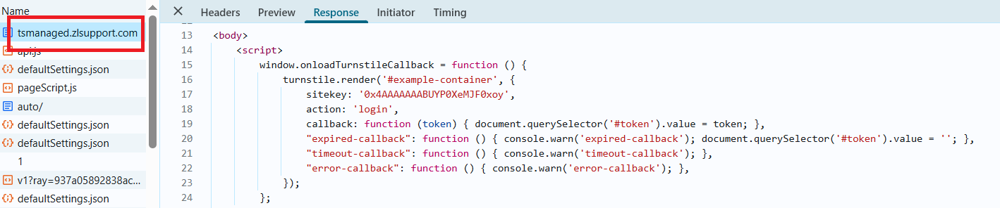

import Tabs from '@theme/Tabs';
import TabItem from '@theme/TabItem';
import ParamItem from '@theme/ParamItem';
import MethodItem from '@theme/MethodItem';
import MethodDescription from '@theme/MethodDescription'
import PriceBlock from '@theme/PriceBlock';
import PriceBlockWrap from '@theme/PriceBlockWrap';
import BlogLink from '@theme/BlogLink';


# TurnstileTask | Cloudflare Challenge

<PriceBlockWrap>
  <PriceBlock title="TurnstileTask" name="turnstileToken"/>
</PriceBlockWrap>

所有 Turnstile 子类型都会自动支持：手动、非交互式和隐形。因此，对于常规验证码，无需指定子类型。

<BlogLink url="https://capmonster.cloud/zh/blog/Cloudflare/what-is-cloudflare-captcha"/>
<BlogLink url="https://capmonster.cloud/zh/blog/Cloudflare/how-cloudflare-bot-challenge-and-turnstile-protect-web-traffic"/>

:::caution 注意！
请查看所有三个验证码识别选项，并选择最适合您的选项。
:::
## 选项 1（Turnstile）
您需要解决一个常规的 Turnstile 验证码，就像这里一[样](https://zenno.link/zl-support)。 请注意，CloudFlare 页面上的验证码可能看起来相同。了解如何区分常规 Turnstile 和 Cloudflare Challenge 的更多信息，请参阅本文末尾。


#### 请求参数
<TabItem value="proxyless" label="RecaptchaV2EnterpriseTaskProxyless (without proxy)" default className="bordered-panel">
  <ParamItem title="type" required type="string" />
  **TurnstileTaskProxyless**

  ---

  <ParamItem title="websiteURL" required type="string" />
  解决验证码的页面地址。

  ---

  <ParamItem title="websiteKey" required type="string" />
  Turnstile 密钥

  ---

  <ParamItem title="pageAction" type="string" />
  可以在加载验证码的回调函数中找到的 `action` 字段
  
  ---

  <ParamItem title="data" type="string" />
  data 字段的值可以从 `cData` 参数中获取。

</TabItem>


## 选项 2（CloudFlare）
您正在通过浏览器工作，需要获取一个令牌来通过 CloudFlare。

#### 请求参数
<TabItem value="proxyless" label="RecaptchaV2EnterpriseTaskProxyless (without proxy)" default className="bordered-panel">
  <ParamItem title="type" required type="string" />
  **TurnstileTaskProxyless**

  ---

  <ParamItem title="websiteURL" required type="string" />
  解决验证码的页面地址

  ---

  <ParamItem title="websiteKey" required type="string" />
  Turnstile 密钥

  ---

  <ParamItem title="cloudflareTaskType" required type="string" />
  **token**

  ---

  <ParamItem title="pageAction" required type="string" />
  在加载验证码的回调函数中可以找到的 `action` 字段。如果使用 cloudflareTaskType，则 `action` 通常为 "managed" 或 "non-interactive"。

  ---

  <ParamItem title="userAgent" required type="string" />
  浏览器 User-Agent。<br /> **仅传递来自 Windows 操作系统的实际 UA。现在是**: userAgentPlaceholder

  ---

  <ParamItem title="data" required type="string" />
  data 字段的值可以从 `cData` 参数中获取。

  ---

  <ParamItem title="pageData" required type="string" />
  pageData 字段的值可以从 `chlPageData` 参数中获取。
  
  ---
  
  <ParamItem title="apiJsUrl" type="string" />
  包含验证码脚本链接的字符串。

</TabItem>

<br />

无需传递代理即可获取令牌。这些参数位于传递给函数 window.turnstile.render(el, paramsObj) 创建验证码时的对象中。您可以通过在加载其他脚本之前执行 JavaScript 来获取它们，例如：

```js
(function () {
  const obj = {
    render: function () {
      const { action, cData, chlPageData } = arguments[1];
        const params = [
          ["action", action],
          ["data", cData],
          ["pageData", chlPageData],
        ];
        console.table(params)
    }
  };

  Object.defineProperty(window, "turnstile", {
    get: () => {
      return obj;
    },
  });
})();
```

调用 `window.turnstile.render(el, paramsObj)` 时，页面上的验证码将被加载，如果成功，将调用一个 `callback` 函数来传递有关解决方案的信息。

`window.turnstile.render(el, paramsObj):`

`el`：要插入验证码的 DOM 元素。

`paramsObj`：包含有关验证码和解决方案指令的参数对象。此对象通常包含诸如 
*sitekey*、*action*、*cData*、*chlPageData*、*callback* 等字段。

`callback` – 是一个在成功通过验证码后调用的回调函数。


## 选项 3（CloudFlare）
您正在通过查询工作，并且需要 cf\_clearance cookies。您需要使用代理。

#### 请求参数
<TabItem value="proxyless" label="RecaptchaV2EnterpriseTaskProxyless (without proxy)" default className="bordered-panel">
  <ParamItem title="type" required type="string" />
  **TurnstileTask**

  ---

  <ParamItem title="websiteURL" required type="string" />
  解决验证码的页面地址

  ---

  <ParamItem title="websiteKey" required type="string" />
  Turnstile 密钥（可以传递任意字符串）

  ---

  <ParamItem title="cloudflareTaskType" type="string" />
  **cf_clearance**

  ---

  <ParamItem title="htmlPageBase64" required type="string" />
  Base64 编码的 html 页面**"Just a moment"**，在访问受此保护的站点时返回代码 403。<br/> 获取 htmlPageBase64 的示例：*<br/>var htmlContent = document.documentElement.outerHTML;<br/>var htmlBase64 = btoa(unescape(encodeURIComponent(htmlContent)));<br/>console.log(htmlBase64);*

  ---

  <ParamItem title="userAgent" required type="string" />
  浏览器 User-Agent。<br /> **仅传递来自 Windows 操作系统的实际 UA。当前版本为**: userAgentPlaceholder

  ---

  <ParamItem title="proxyType" required type="string" />
  **http** - 普通的 http/https 代理<br/>**https** - 如果 "http" 不起作用，请尝试此选项（适用于某些自定义代理）<br/>**socks4** - socks4 代理<br/>**socks5** - socks5 代理

  ---

  <ParamItem title="proxyAddress" required type="string" />
  <p>
    IPv4/IPv6 代理的 IP 地址。不允许：<br/>- 使用主机名<br/>- 使用透明代理（可以看到客户端 IP）<br/>- 在本地机器上使用代理
  </p>

  ---

  <ParamItem title="proxyPort" required type="integer" />
  代理端口

  ---

  <ParamItem title="proxyLogin" required type="string" />
  代理服务器登录

  ---

  <ParamItem title="proxyPassword" required type="string" />
  代理服务器密码

</TabItem>


## 请求示例
### 选项 1: 普通 Turnstile

<TabItem value="proxyless" label="TurnstileTaskProxyless (without proxy)" default className="method-panel">
	<MethodItem>
		```http
		https://api.capmonster.cloud/createTask
		```
	</MethodItem>
	<MethodDescription>
		**要求**
		```json
		{
			"clientKey":"API_KEY",
			"task":
			{
				"type":"TurnstileTaskProxyless",
				"websiteURL":"http://tsmanaged.zlsupport.com",
				"websiteKey":"0x4AAAAAAABUYP0XeMJF0xoy"
			}
		}
		```
		**回应**
		```json
		{
		  "errorId":0,
		  "taskId":407533072
		}
		```
	</MethodDescription>
</TabItem>


### 选项 2.CloudFlare（token）
<TabItem value="proxyless" label="RecaptchaV2TaskProxyless (without proxy)" default className="method-panel">
	<MethodItem>
		```http
		https://api.capmonster.cloud/createTask
		```
	</MethodItem>
	<MethodDescription>
		**要求**
		```json
		{
			"clientKey": "API_KEY",
			"task": {
				"type": "TurnstileTask",
				"websiteURL": "https://example.com",
				"websiteKey": "0x4AAAAAAADnPIDROrmt1Wwj",
				"cloudflareTaskType": "token",
				"userAgent":"userAgentPlaceholder",
				"pageAction": "managed",
				"pageData": "HUHDWUHuhuwfiweh32..uh2uhuhyugYUG=",
				"data": "874291f4retD1366"
			}
		}
		```
		**回应**
		```json
		{
		  "errorId":0,
		  "taskId":407533072
		}
		```
	</MethodDescription>
</TabItem>


### 选项 3.CloudFlare（cookie）
<TabItem value="proxyless" label="RecaptchaV2TaskProxyless (without proxy)" default className="method-panel">
	<MethodItem>
		```http
		https://api.capmonster.cloud/createTask
		```
	</MethodItem>
	<MethodDescription>
		**Request**
		```json 
		{
		  "clientKey":"API_KEY",
		  "task": {
			"type":"TurnstileTask",
			"websiteURL":"https://example.com",
			"websiteKey":"xxxxxxxxxx",
			"cloudflareTaskType": "cf_clearance",
			"htmlPageBase64": "PCFET0NUWVBFIGh0...vYm9keT48L2h0bWw+",
			"userAgent": "userAgentPlaceholder",
			"proxyType":"http",
			"proxyAddress":"8.8.8.8",
			"proxyPort":8080,
			"proxyLogin":"proxyLoginHere",
			"proxyPassword":"proxyPasswordHere"
		  }
		}
		```
		**Response**
		```json
		{
		  "errorId":0,
		  "taskId":407533072
		}
		```
	</MethodDescription>
</TabItem>


## 获取任务结果方法
使用 [getTaskResult](../api/methods/get-task-result.md) 方法获取 Turnstile 解决方案。根据系统负载情况，您将在 5 到 20 秒内收到响应。

|**属性**|**类型**|**描述**|
| :- | :- | :- |
|cf_clearance|String|特殊的 Cloudflare cookie，可以用于浏览器中|
|token|String|在调用回调函数时使用的 token|


## 如何区分普通 Turnstile 和 Cloudflare Challenge
Cloudflare 挑战的外观可能不同。

**普通变体：**


**风格化变体：**

<figure>


<figcaption>挑战无缝集成到网站本身。</figcaption>

</figure>

<figure>


<figcaption>外观类似于普通 turnstile CAPTCHA，但实际上是一个挑战。</figcaption>

</figure>

要最终确认Cloudflare的存在，您可以打开开发者工具，查看网络流量，检查页面代码，并查看以下特征标志：

- 第一个对站点的请求返回403状态码：


- 具有id为**challenge-form**的表单有一个**action**属性（注意不要与turnstile验证码的参数混淆），其中包含`__cf_chl_f_tk=`参数：


- 页面包含两个类似的`<script>`标签，在`window`对象中创建了一个新的值：


<details>
        <summary>使用Node.js上的Selenium实现解决方案示例</summary>

```js

const { Builder } = require('selenium-webdriver');
const chrome = require('selenium-webdriver/chrome');

(async function example() {
  const options = new chrome.Options();
  options.addArguments('--auto-open-devtools-for-tabs')

  const driver = new Builder()
    .forBrowser('chrome')
    .setChromeOptions(options)
    .build();

  try {
    driver.executeScript(`
    window.turnstile = new Proxy(window.turnstile, {
      get(target, prop) {
        if (prop === 'render') {
          return function(a, b) {
            let p = {
              type: "TurnstileTaskProxyless",
              websiteKey: b.sitekey,
              websiteURL: window.location.href,
              data: b.cData,
              pagedata: b.chlPageData,
              action: b.action,
              userAgent: navigator.userAgent
          }
          
          console.log(JSON.stringify(p))
          window.params = p;
          window.turnstileCallback = b.callback;
            return target.render.apply(this, arguments);
          }
        }
        return target[prop];
      }
    });
    `)

    driver.get('站点网址');
    

    const params = await driver.executeScript(`
      return new Promise((resolve, reject) => {
        setTimeout(() => {
          resolve(window.params)
        }, 2000)
      })
    `);

    if (params) {
      const data = {
        clientKey: 'API KEY',
        task: {
          type: 'TurnstileTaskProxyless',
          websiteURL: params.websiteURL,
          websiteKey: params.websiteKey,
          data: params.data,
          action: params.action
        }
      }

      const createResult = await fetch('https://api.capmonster.cloud/createTask', {
        method: 'post',
        body: JSON.stringify(data)
      });

      const createTaskResult = await createResult.json()

      if (createTaskResult.taskId) {
        const asyncDelay = (timeout) =>
          new Promise(resolve => {
              setTimeout(() => {
                  resolve();
              }, timeout);
          });
        
        const getTaskResult = async (taskId) => {
          const taskResult = await fetch('https://api.capmonster.cloud/getTaskResult', {
            method: 'post',
            body: JSON.stringify({
              "clientKey":"API KEY",
              "taskId": createTaskResult.taskId
            })
          });
          const taskResponse = await taskResult.json();
          if (taskResponse.status === 'processing') {
            await asyncDelay(5000);
            return await getTaskResult(taskId)
          }
          return taskResponse;
        }
       
        const taskRes = await getTaskResult(createTaskResult.taskId)

        if (taskRes.solution) {
          await driver.executeScript(`
            window.turnstileCallback(${taskRes.solution.token});
          `);
        }
      }
      
    }

    //做一些事情
  } finally {
    await driver.quit();
  }
})();
```
</details>

## 如何查找任务创建所需的所有参数

### 手动方式

1. 请在浏览器中访问您的网站，该网站包含验证码功能。
2. 右键点击验证码元素，选择 **检查（Inspect）**。

#### 方法一

#### websiteKey(网站密钥)

可以在 **元素(Elements)** 标签页中找到：


也可以通过控制台命令获取（在验证码URL的独立标签页中打开，URL通常以`https://challenges.cloudflare.com/cdn-cgi/challenge-platform/h/g...`开头）：

`console.log(window._cf_chl_opt.chlApiSitekey);`

*chlApiSitekey* 就是 sitekey

#### pageAction(页面动作)

*Action* 和 *sitekey* 也可以在 *callback* 回调函数中找到：



对于 **方法二** 和 **方法三**，建议使用自动化方式提取参数：

### 自动方法

一种方便的自动化获取所有必要参数的方式。
某些参数每次页面加载时都会重新生成，因此需要通过浏览器（普通或无头模式，如使用**Playwright**）提取它们。
由于动态参数值的有效期很短，获取后必须立即解决验证码。

:::warning **重要提示！**
提供的代码片段是用于熟悉参数提取的基本示例。具体实现将取决于验证码页面、其结构及使用的HTML元素/选择器。
:::

<Tabs className="full-width-tabs filled-tabs request-tabs">
  <TabItem value="js" label="JavaScript" default className="method-panel">
    <details>
      <summary>方法一 (浏览器内)</summary>

      ```js
      // 检查window.onloadTurnstileCallback是否存在的函数
      const checkTurnstileCallback = () => {
        return new Promise((resolve, reject) => {
          const timeout = setTimeout(() => reject('回调超时'), 30000);

          const interval = setInterval(() => {
            if (window.onloadTurnstileCallback !== undefined) {
              clearInterval(interval);
              clearTimeout(timeout);

              const callbackDetails = window.onloadTurnstileCallback.toString();
              const sitekeyMatch = callbackDetails.match(/sitekey: ['"]([^'"]+)['"]/);
              const actionMatch = callbackDetails.match(/action: ['"]([^'"]+)['"]/);

              resolve({
                sitekey: sitekeyMatch ? sitekeyMatch[1] : null,
                action: actionMatch ? actionMatch[1] : null,
              });
            }
          }, 500);
        });
      };

      // 尝试查找带有data-sitekey属性的元素
      const turnstileElement = document.querySelector('[data-sitekey]');

      if (turnstileElement) {
        // 提取data-sitekey属性值
        const sitekey = turnstileElement.getAttribute("data-sitekey");
        console.log("Turnstile Sitekey (从元素获取):", sitekey);
      } else {
        console.log("未找到Turnstile元素，正在通过回调检查...");

        // 如果找不到元素，通过window.onloadTurnstileCallback检查
        checkTurnstileCallback()
          .then((data) => {
            console.log("Turnstile参数 (从回调获取):", data);
          })
          .catch((error) => {
            console.error(error);
          });
      }
      ```
    </details>

    <details>
      <summary>方法二 (Node.js)</summary>

      ```js
      import { chromium } from "playwright";

      (async () => {
        const browser = await chromium.launch({ headless: false });
        const page = await browser.newPage();

        let params = null;

        try {
          while (!params) {
            await page.goto("https://example.com");

            await page.evaluate(() => {
              window.turnstile = new Proxy(window.turnstile, {
                get(target, prop) {
                  if (prop === "render") {
                    return function (a, b) {
                      const p = {
                        websiteKey: b.sitekey,
                        websiteURL: window.location.href,
                        data: b.cData,
                        pagedata: b.chlPageData,
                        action: b.action,
                        userAgent: navigator.userAgent,
                      };
                      window.params = p;
                      return target.render.apply(this, arguments);
                    };
                  }
                  return target[prop];
                },
              });
            });

            params = await page.evaluate(() => {
              return new Promise((resolve) => {
                setTimeout(() => resolve(window.params || null), 5000);
              });
            });

            if (!params) {
              await page.waitForTimeout(3000);
            }
          }

          console.log("Turnstile参数:", params);
        } finally {
          await browser.close();
        }
      })();
      ```
    </details>

    <details>
      <summary>方法三 (Node.js)</summary>

      ```js
      import { chromium } from "playwright";
      import { Buffer } from "buffer";

      (async () => {
        const browser = await chromium.launch({ headless: false });
        const page = await browser.newPage();

        let websiteKey = null;

        while (!websiteKey) {
          await page.goto("https://example.com");

          await page.evaluate(() => {
            window.turnstile = new Proxy(window.turnstile, {
              get(target, prop) {
                if (prop === "render") {
                  return function (a, b) {
                    window.websiteKey = b.sitekey;
                    return target.render.apply(this, arguments);
                  };
                }
                return target[prop];
              },
            });
          });

          websiteKey = await page.evaluate(() => {
            return new Promise((resolve) => {
              setTimeout(() => resolve(window.websiteKey || null), 5000);
            });
          });

          if (!websiteKey) {
            await page.waitForTimeout(3000);
          }
        }

        const html = await page.content();
        const htmlPageBase64 = Buffer.from(html).toString("base64");

        const result = {
          websiteKey,
          htmlPageBase64,
        };

        console.log(result);

        await browser.close();
      })();
      ```
    </details>
  </TabItem>

  <TabItem value="python" label="Python" className="method-panel">
    <details>
      <summary>方法一</summary>

      ```python
      import asyncio
      from playwright.async_api import async_playwright

      async def run():
          async with async_playwright() as p:
              browser = await p.chromium.launch(headless=False)
              context = await browser.new_context()
              page = await context.new_page()

              await page.goto("https://example.com")  # 替换为您的网站

              # 尝试查找带有data-sitekey属性的元素
              element = await page.query_selector('[data-sitekey]')
              if element:
                  sitekey = await element.get_attribute("data-sitekey")
                  print("Turnstile Sitekey (从元素获取):", sitekey)
              else:
                  print("未找到Turnstile元素，正在通过回调检查...")

                  try:
                      result = await page.evaluate('''() => {
                          return new Promise((resolve, reject) => {
                              const timeout = setTimeout(() => reject('回调超时'), 30000);
                              const interval = setInterval(() => {
                                  if (window.onloadTurnstileCallback !== undefined) {
                                      clearInterval(interval);
                                      clearTimeout(timeout);
                                      const cbStr = window.onloadTurnstileCallback.toString();
                                      const sitekeyMatch = cbStr.match(/sitekey: ['"]([^'"]+)['"]/);
                                      const actionMatch = cbStr.match(/action: ['"]([^'"]+)['"]/);
                                      resolve({
                                          sitekey: sitekeyMatch ? sitekeyMatch[1] : null,
                                          action: actionMatch ? actionMatch[1] : null,
                                      });
                                  }
                              }, 500);
                          });
                      }''')
                      print("Turnstile参数 (从回调获取):", result)
                  except Exception as e:
                      print("错误:", e)

              await browser.close()

      asyncio.run(run())
      ```
    </details>

    <details>
      <summary>方法二</summary>

      ```python
      import asyncio
      from playwright.async_api import async_playwright

      async def extract_turnstile_params():
          async with async_playwright() as p:
              browser = await p.chromium.launch(headless=False)
              page = await browser.new_page()

              params = None

              while not params:
                  await page.goto("https://example.com")

                  await page.evaluate("""
                      window.turnstile = new Proxy(window.turnstile, {
                        get(target, prop) {
                          if (prop === "render") {
                            return function(a, b) {
                              const p = {
                                websiteKey: b.sitekey,
                                websiteURL: window.location.href,
                                data: b.cData,
                                pagedata: b.chlPageData,
                                action: b.action,
                                userAgent: navigator.userAgent
                              };
                              window.params = p;
                              return target.render.apply(this, arguments);
                            };
                          }
                          return target[prop];
                        }
                      });
                  """)

                  await page.wait_for_timeout(5000)

                  params = await page.evaluate("window.params || null")

                  if not params:
                      await page.wait_for_timeout(3000)

              print("Turnstile参数:", params)

              await browser.close()

      asyncio.run(extract_turnstile_params())
      ```
    </details>

    <details>
      <summary>方法三</summary>

      ```python
      import asyncio
      import base64
      from playwright.async_api import async_playwright

      async def main():
          async with async_playwright() as p:
              browser = await p.chromium.launch(headless=False)
              page = await browser.new_page()

              website_key = None

              while not website_key:
                  await page.goto("https://example.com")

                  await page.evaluate("""
                      () => {
                          window.turnstile = new Proxy(window.turnstile, {
                              get(target, prop) {
                                  if (prop === 'render') {
                                      return function(a, b) {
                                          window.websiteKey = b.sitekey;
                                          return target.render.apply(this, arguments);
                                      };
                                  }
                                  return target[prop];
                              }
                          });
                      }
                  """)

                  website_key = await page.evaluate("""
                      () => new Promise(resolve => {
                          setTimeout(() => resolve(window.websiteKey || null), 5000);
                      })
                  """)

                  if not website_key:
                      await page.wait_for_timeout(3000)

              html = await page.content()
              html_base64 = base64.b64encode(html.encode("utf-8")).decode("utf-8")

              result = {
                  "websiteKey": website_key,
                  "htmlPageBase64": html_base64
              }

              print(result)

              await browser.close()

      asyncio.run(main())
      ```
    </details>
  </TabItem>

  <TabItem value="csharp" label="C#" className="method-panel">
    <details>
      <summary>方法一</summary>

      ```csharp
      using System;
      using System.Text.RegularExpressions;
      using System.Threading.Tasks;
      using Microsoft.Playwright;

      class Program
      {
          public static async Task Main()
          {
              using var playwright = await Playwright.CreateAsync();
              var browser = await playwright.Chromium.LaunchAsync(new BrowserTypeLaunchOptions
              {
                  Headless = false
              });

              var context = await browser.NewContextAsync();
              var page = await context.NewPageAsync();

              await page.GotoAsync("https://example.com"); // 替换为目标URL

              var element = await page.QuerySelectorAsync("[data-sitekey]");

              if (element != null)
              {
                  var sitekey = await element.GetAttributeAsync("data-sitekey");
                  Console.WriteLine($"Turnstile Sitekey (从元素获取): {sitekey}");
              }
              else
              {
                  Console.WriteLine("未找到Turnstile元素，正在通过回调检查...");

                  try
                  {
                      var result = await page.EvaluateAsync(@"() => {
                          return new Promise((resolve, reject) => {
                              const timeout = setTimeout(() => reject('回调超时'), 30000);
                              const interval = setInterval(() => {
                                  if (window.onloadTurnstileCallback !== undefined) {
                                      clearInterval(interval);
                                      clearTimeout(timeout);
                                      const cbStr = window.onloadTurnstileCallback.toString();
                                      const sitekeyMatch = cbStr.match(/sitekey: ['""]([^'""]+)['""]/);
                                      const actionMatch = cbStr.match(/action: ['""]([^'""]+)['""]/);
                                      resolve({
                                          sitekey: sitekeyMatch ? sitekeyMatch[1] : null,
                                          action: actionMatch ? actionMatch[1] : null
                                      });
                                  }
                              }, 500);
                          });
                      }");

                      Console.WriteLine("Turnstile参数 (从回调获取): " + result?.ToString());
                  }
                  catch (Exception ex)
                  {
                      Console.WriteLine("错误: " + ex.Message);
                  }
              }

              await browser.CloseAsync();
          }
      }
      ```
    </details>

    <details>
      <summary>方法二</summary>

      ```csharp
      using Microsoft.Playwright;
      using System.Text.Json;

      class Program
      {
          public static async Task Main()
          {
              using var playwright = await Playwright.CreateAsync();
              var browser = await playwright.Chromium.LaunchAsync(new BrowserTypeLaunchOptions
              {
                  Headless = false
              });

              var page = await browser.NewPageAsync();
              object? parameters = null;

              while (parameters == null)
              {
                  await page.GotoAsync("https://example.com");

                  await page.EvaluateAsync(@"() => {
                      window.turnstile = new Proxy(window.turnstile, {
                          get(target, prop) {
                              if (prop === 'render') {
                                  return function(a, b) {
                                      const p = {
                                          websiteKey: b.sitekey,
                                          websiteURL: window.location.href,
                                          data: b.cData,
                                          pagedata: b.chlPageData,
                                          action: b.action,
                                          userAgent: navigator.userAgent
                                      };
                                      window.params = p;
                                      return target.render.apply(this, arguments);
                                  };
                              }
                              return target[prop];
                          }
                      });
                  }");

                  parameters = await page.EvaluateAsync(@"() => new Promise(resolve => {
                      setTimeout(() => resolve(window.params || null), 5000);
                  })");

                  if (parameters == null)
                  {
                      await page.WaitForTimeoutAsync(3000);
                  }
              }

              Console.WriteLine("Turnstile参数:");
              Console.WriteLine(JsonSerializer.Serialize(parameters, new JsonSerializerOptions { WriteIndented = true }));

              await browser.CloseAsync();
          }
      }
      ```
    </details>

    <details>
      <summary>方法三</summary>

      ```csharp
      using System;
      using System.Text;
      using System.Threading.Tasks;
      using Microsoft.Playwright;

      class Program
      {
          public static async Task Main()
          {
              using var playwright = await Playwright.CreateAsync();
              var browser = await playwright.Chromium.LaunchAsync(
                new BrowserTypeLaunchOptions { Headless = false });
              var page = await browser.NewPageAsync();

              string websiteKey = null;

              while (websiteKey == null)
              {
                  await page.GotoAsync("https://example.com");

                  await page.EvaluateAsync(@"() => {
                      window.turnstile = new Proxy(window.turnstile, {
                          get(target, prop) {
                              if (prop === 'render') {
                                  return function(a, b) {
                                      window.websiteKey = b.sitekey;
                                      return target.render.apply(this, arguments);
                                  };
                              }
                              return target[prop];
                          }
                      });
                  }");

                  websiteKey = await page.EvaluateAsync<string>(@"() => 
                  new Promise(resolve => {
                      setTimeout(() => resolve(window.websiteKey || null), 5000);
                  })");

                  if (websiteKey == null)
                  {
                      await page.WaitForTimeoutAsync(3000);
                  }
              }

              var html = await page.ContentAsync();
              var htmlBase64 = Convert.ToBase64String(Encoding.UTF8.GetBytes(html));

              Console.WriteLine($"websiteKey: {websiteKey}");
              Console.WriteLine($"htmlPageBase64: {htmlBase64}");

              await browser.CloseAsync();
          }
      }
      ```
    </details>
  </TabItem>
</Tabs>

## 使用 SDK 库

<Tabs className="full-width-tabs filled-tabs request-tabs" groupId="captcha-type">
  <TabItem value="js" label="JavaScript" default className="method-panel">
    ```js
    // https://github.com/ZennoLab/capmonstercloud-client-js

    import { CapMonsterCloudClientFactory, ClientOptions, TurnstileRequest } from '@zennolab_com/capmonstercloud-client';

    document.addEventListener('DOMContentLoaded', async () => {
      const cmcClient = CapMonsterCloudClientFactory.Create(new ClientOptions({ clientKey: '<your capmonster.cloud API key>' }));
      console.log(await cmcClient.getBalance());

      const turnstileRequest = new TurnstileRequest({
        websiteURL: 'https://tsinvisble.zlsupport.com',
        websiteKey: '0x4AAAAAAABUY0VLtOUMAHxE',
        cloudflareTaskType: 'cf_clearance',
        proxyType: 'http',
        proxyAddress: '8.8.8.8',
        proxyPort: 8080,
        proxyLogin: 'proxyLoginHere',
        proxyPassword: 'proxyPasswordHere',
        pageData: 'pageDataHere',
        data: 'dataHere',
        htmlPageBase64: 'htmlPageBase64Here',
        userAgent: 'userAgentHere',
      });

      console.log(await cmcClient.Solve(turnstileRequest));
    });
    ```
  </TabItem>
  
  <TabItem value="python" label="Python" className="method-panel">
    ```python
    # https://github.com/ZennoLab/capmonstercloud-client-python

    # Cloudflare Turnstile:

    import asyncio
    from capmonstercloudclient import CapMonsterClient, ClientOptions
    from capmonstercloudclient.requests import TurnstileRequest

    client_options = ClientOptions(api_key="your_api_key")  # Replace with your CapMonsterCloud API key
    cap_monster_client = CapMonsterClient(options=client_options)

    turnstile_request = TurnstileRequest(
        websiteURL="http://tsmanaged.zlsupport.com",  # Replace with the URL of the page with the captcha
        websiteKey="0x4AAAAAAABUYP0XeMJF0xoy"  # Replace with the website key for the captcha
    )

    async def solve_captcha():
        return await cap_monster_client.solve_captcha(turnstile_request)

    responses = asyncio.run(solve_captcha())
    print(responses)
    ```

    ```python
    # Cloudflare Challenge (token)

    import asyncio
    from capmonstercloudclient import CapMonsterClient, ClientOptions
    from capmonstercloudclient.requests import TurnstileProxylessRequest

    client_options = ClientOptions(api_key="your_api_key")  # Replace with your CapMonsterCloud API key
    cap_monster_client = CapMonsterClient(options=client_options)

    turnstile_request = TurnstileProxylessRequest(
        websiteURL="https://example.com",  # Replace with the URL of the page with the captcha
        websiteKey="0x4AAAAAAABUYP0XeMJF0xoy",  # Replace with the website key for the captcha
        data="YOUR_DATA_HERE",
        pageAction="managed",
        cloudflareTaskType="token",
        pageData="YOUR_PAGE_DATA_HERE",
        userAgent="Mozilla/5.0 (Windows NT 10.0; Win64; x64) AppleWebKit/537.36 (KHTML, like Gecko) Chrome/130.0.0.0 Safari/537.36"  # Use the current userAgent
    )

    async def solve_captcha():
        return await cap_monster_client.solve_captcha(turnstile_request)

    responses = asyncio.run(solve_captcha())
    print(responses)
    ```

    ```python
    # Cloudflare Challenge (cookie cf_clearance)

    import asyncio
    from capmonstercloudclient import CapMonsterClient, ClientOptions
    from capmonstercloudclient.requests import TurnstileRequest

    client_options = ClientOptions(api_key="your_api_key")  # Replace with your CapMonsterCloud API key
    cap_monster_client = CapMonsterClient(options=client_options)

    turnstile_request = TurnstileRequest(
        websiteURL="https://example.com",  # Replace with the URL of the page with the captcha
        websiteKey="0x4AAAAAAABUYP0XeMJF0xoy",  # Replace with the website key for the captcha
        cloudflareTaskType="cf_clearance",
        userAgent="Mozilla/5.0 (Windows NT 10.0; Win64; x64) AppleWebKit/537.36 (KHTML, like Gecko) Chrome/130.0.0.0 Safari/537.36",  # Use the current userAgent
        htmlPageBase64="htmlPageBase64Here",
        proxyType="http",  # Type of proxy (http, https, socks4, socks5)
        proxyAddress="8.8.8.8",
        proxyPort=8000,
        proxyLogin="proxyLoginHere",
        proxyPassword="proxyPasswordHere"
    )

    async def solve_captcha():
        return await cap_monster_client.solve_captcha(turnstile_request)

    responses = asyncio.run(solve_captcha())
    print(responses)
    ```
  </TabItem>
  
  <TabItem value="csharp" label="C#" className="method-panel">
    ```csharp
    // https://github.com/ZennoLab/capmonstercloud-client-dotnet

    // Cloudflare Turnstile:

    using Zennolab.CapMonsterCloud.Requests;
    using Zennolab.CapMonsterCloud;

    class Program
    {
        static async Task Main(string[] args)
        {
            var clientOptions = new ClientOptions
            {
                ClientKey = "your_api_key" // Replace with your CapMonster Cloud API key
            };

            var cmCloudClient = CapMonsterCloudClientFactory.Create(clientOptions);

            var turnstileRequest = new TurnstileProxylessRequest
            {
                WebsiteUrl = "http://tsmanaged.zlsupport.com",  // Replace with the URL of the page with the captcha
                WebsiteKey = "0x4AAAAAAABUYP0XeMJF0xoy"  // Replace with the website key for the captcha
            };

            var turnstileResult = await cmCloudClient.SolveAsync(turnstileRequest);

            Console.WriteLine("Captcha Solution: " + turnstileResult.Solution.Value);
        }
    }
    ```

    ```csharp
    // Cloudflare Challenge (token):

    using Zennolab.CapMonsterCloud.Requests;
    using Zennolab.CapMonsterCloud;

    class Program
    {
        static async Task Main(string[] args)
        {
            var clientOptions = new ClientOptions
            {
                ClientKey = "your_api_key" // Replace with your CapMonster Cloud API key
            };

            var cmCloudClient = CapMonsterCloudClientFactory.Create(clientOptions);

            var turnstileRequest = new TurnstileProxylessRequest
            {
                WebsiteUrl = "https://example.com",  // Replace with the URL of the page with the captcha
                WebsiteKey = "0x4AAAAAAABUYP0XeMJF0xoy",  // Replace with the website key for the captcha
                Data = "data_here",
                PageAction = "managed",
                CloudflareTaskType = "token",
                PageData = "pagedata_here",
                UserAgent = "Mozilla/5.0 (Windows NT 10.0; Win64; x64) AppleWebKit/537.36 (KHTML, like Gecko) Chrome/130.0.0.0 Safari/537.36" // Use the current UserAgent
            };

            var turnstileResult = await cmCloudClient.SolveAsync(turnstileRequest);

            Console.WriteLine("Captcha Solution: " + turnstileResult.Solution.Value);
        }
    }
    ```

    ```csharp
    // Cloudflare Challenge (cookie cf_clearance):

    using Zennolab.CapMonsterCloud.Requests;
    using Zennolab.CapMonsterCloud;

    class Program
    {
        static async Task Main(string[] args)
        {
            var clientOptions = new ClientOptions
            {
                ClientKey = "your_api_key" // Replace with your CapMonster Cloud API key
            };

            var cmCloudClient = CapMonsterCloudClientFactory.Create(clientOptions);

            var turnstileRequest = new TurnstileRequest
            {
                WebsiteUrl = "https://example.com", // URL with Turnstile challenge
                WebsiteKey = "0x4AAAAAAADnPIDROrmt1Wwj", // Replace with the correct website key
                CloudflareTaskType = "cf_clearance",
                ProxyType = ProxyType.Http, // Replace with the required type
                ProxyAddress = "8.8.8.8",
                ProxyPort = 8000,
                ProxyLogin = "proxyLoginHere",
                ProxyPassword = "proxyPasswordHere",
                PageData = "pageDataHere",
                Data = "pageDataHere",
                HtmlPageBase64 = "htmlPageBase64Here",
                UserAgent = "Mozilla/5.0 (Windows NT 10.0; Win64; x64) AppleWebKit/537.36 (KHTML, like Gecko) Chrome/130.0.0.0 Safari/537.36" // Use an up-to-date userAgent
            };

            var turnstileResult = await cmCloudClient.SolveAsync(turnstileRequest);

            Console.WriteLine("Captcha Solved. cf_clearance cookie: " + turnstileResult.Solution.Clearance);
        }
    }
    ```
  </TabItem>
</Tabs>