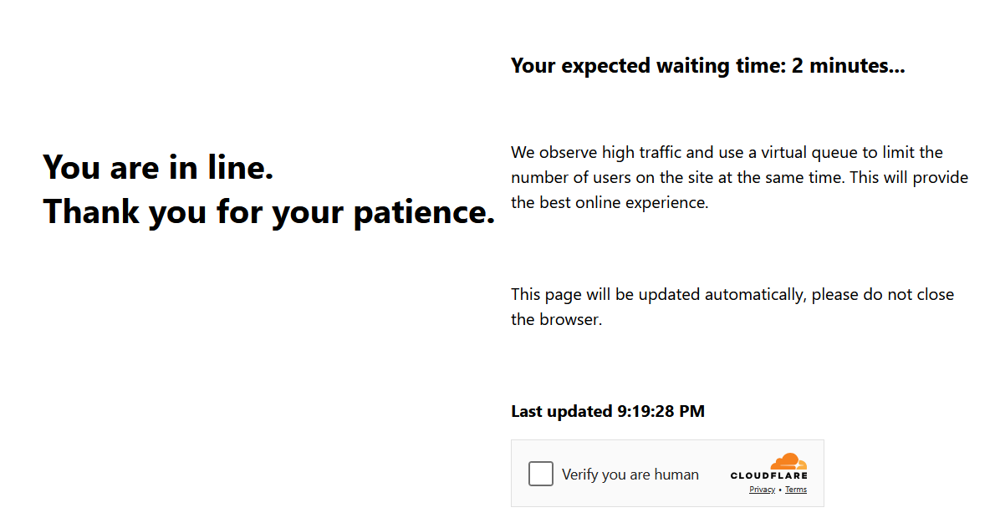

import Tabs from '@theme/Tabs';
import TabItem from '@theme/TabItem';
import ParamItem from '@theme/ParamItem';
import MethodItem from '@theme/MethodItem';
import MethodDescription from '@theme/MethodDescription'
import PriceBlock from '../../../../../src/theme/PriceBlock'
import PriceBlockWrap from '@theme/PriceBlockWrap';
import BlogLink from '@theme/BlogLink';
import { ArticleHead } from '../../../../../src/theme/ArticleHead';

<ArticleHead slug="captchas/turnstile-waitroom-task" />

# Cloudflare Waiting Room

<PriceBlockWrap>
  <PriceBlock title="Cloudflare Waiting Room" captchaId="cf-turnstile"/>
</PriceBlockWrap>

这是 Cloudflare 的一种新防护机制：用户在访问资源前平均需要等待约 3 分钟：



你也可以通过页面头部识别这种 Cloudflare 类型：


<BlogLink url="https://capmonster.cloud/zh/blog/Cloudflare/what-is-cloudflare-captcha"/>
<BlogLink url="https://capmonster.cloud/zh/blog/Cloudflare/how-cloudflare-bot-challenge-and-turnstile-protect-web-traffic"/>

## 请求参数

:::warning **注意！**

* 对此任务请使用 **自定义代理**。

* 解决后，你将收到 **特殊 cookies**，需添加到浏览器。
:::

<TabItem value="proxyless" label="RecaptchaV2EnterpriseTaskProxyless（无需代理）" default className="bordered-panel">
  <ParamItem title="type" required type="string" />
  **TurnstileTask**

---

  <ParamItem title="websiteURL" required type="string" />
  包含检查的页面 URL

---

  <ParamItem title="websiteKey" required type="string" />
  Cloudflare 网站 key

---

  <ParamItem title="cloudflareTaskType" required type="string" />
  **wait_room**

---

  <ParamItem title="htmlPageBase64" required type="string" />
  包含 `<title>Waiting Room powered by Cloudflare</title>` 的 Base64 编码 HTML 页面<br/>
  获取 `htmlPageBase64` 示例：
```js
var serializer = new XMLSerializer();
var fullHtml = serializer.serializeToString(document);

var htmlBase64 = btoa(unescape(encodeURIComponent(fullHtml)));
console.log(htmlBase64);
```

---

  <ParamItem title="userAgent" required type="string" />
  浏览器 User-Agent。<br />
  **仅提供当前 Windows UA:** userAgentPlaceholder

---

  <ParamItem title="proxyType" required type="string" />
  **http** - 常规 HTTP/HTTPS 代理；<br />
  **https** - 当 http 不可用时使用（某些自定义代理必填）；<br />
  **socks4** - SOCKS4 代理；<br />
  **socks5** - SOCKS5 代理。

---

  <ParamItem title="proxyAddress" required type="string" />
  <p>
    代理 IP 地址（IPv4/IPv6）。禁止使用：
    - 透明代理
    - 本地机器代理
  </p>

---

  <ParamItem title="proxyPort" required type="integer" />
  代理端口

---

  <ParamItem title="proxyLogin" required type="string" />
  代理登录名

---

  <ParamItem title="proxyPassword" required type="string" />
  代理密码

</TabItem>
---
## 创建任务方法

<TabItem value="proxyless" label="TurnstileTask（无需代理）" default className="method-panel">
	<MethodItem>
		```http
		https://api.capmonster.cloud/createTask
		```
	</MethodItem>
	<MethodDescription>
		**请求**
		```json 
		{
		  "clientKey":"API_KEY",
		  "task": {
			"type":"TurnstileTask",
			"websiteURL":"https://example.com",
			"websiteKey":"xxxxxxxxxx",
			"cloudflareTaskType": "wait_room",
			"htmlPageBase64": "PCFET0NUWVBFIGh0...vYm9keT48L2h0bWw+",
			"userAgent": "userAgentPlaceholder",
			"proxyType":"http",
			"proxyAddress":"8.8.8.8",
			"proxyPort":8080,
			"proxyLogin":"proxyLoginHere",
			"proxyPassword":"proxyPasswordHere"
		  }
		}
		```
		**响应**
		```json
		{
		  "errorId":0,
		  "taskId":407533072
		}
		```
	</MethodDescription>
</TabItem>
---

## 获取任务结果方法
使用 [getTaskResult](../api/methods/get-task-result.mdx) 方法来获取等待室解决方案。根据系统负载，响应可能需要 5 到 20 秒。

<TabItem value="proxyless" label="TurnstileTask（无需代理）" default className="method-panel-full">
  <MethodItem>
    ```http
    https://api.capmonster.cloud/getTaskResult
    ```
  </MethodItem>
  <MethodDescription>
    **请求**
    ```json
    {
      "clientKey": "API_KEY",
      "taskId": 407533072
    }
    ```

    **响应**
    ```json
    {
      "errorId": 0,
      "status": "ready",
      "solution": {
        "cf_clearance": "1tarGvbY2_ZhQdYxpSBloao.FoOn9VtcJtmb_IQ_hCE-1761217338-1.2.1.1-vyVPoLYIGX0VCJomVuLjF7n0kdM0PXaPjpDsRcohxGr7hb2CE7WfcHpmQZ70goqEjdWxPsDhSVaKNTz9opxWguiNdWEEq_.SceWXIqfP7tnEb69f3bP0mixNqcWy_5P_9INpoAEqr1k7aYU0r45PT4gPr5pwHxedVySyLRdoBXIJasdTE52YOQ3NPdGWTwQ_3h2n_wYqqIvf0kCSAvimRrmsgZxomlyejwqPI6ZHi.w"
      }
    }
    ```
  </MethodDescription>
</TabItem>

|**属性**|**类型**|**说明**|
| :- | :- | :- |
|cf_clearance|字符串|特殊的 Cloudflare cookies，可设置到浏览器中|

