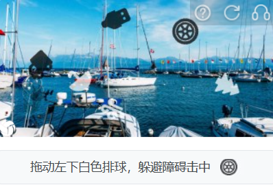
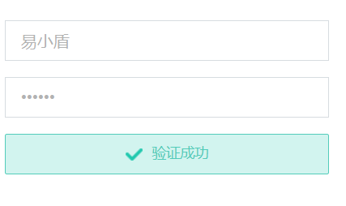
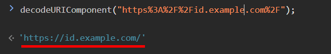
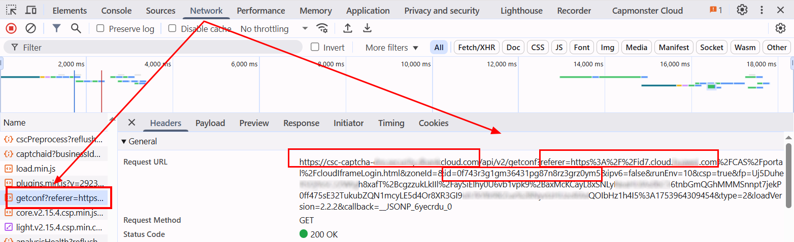
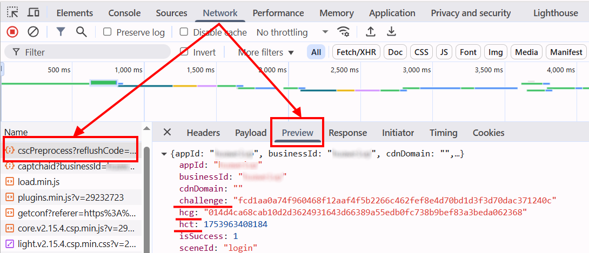

import Tabs from '@theme/Tabs';
import TabItem from '@theme/TabItem';
import ParamItem from '@theme/ParamItem';
import MethodItem from '@theme/MethodItem';
import MethodDescription from '@theme/MethodDescription'
import PriceBlock from '@theme/PriceBlock';
import PriceBlockWrap from '@theme/PriceBlockWrap';
import { ArticleHead } from '../../../../../src/theme/ArticleHead';

<ArticleHead slug="captchas/yidun-task" />

# Yidun - NECaptcha

<PriceBlockWrap>
  <PriceBlock title="Yidun task" captchaId="yidun"/>
</PriceBlockWrap>

## 任务示例

<Tabs className="full-width-tabs">
  <TabItem value="jigsaw" label="Jigsaw" default>
    
  </TabItem>
  <TabItem value="picture-click" label="Picture-click">
    
  </TabItem>
  <TabItem value="avoid" label="Avoid">
    
  </TabItem>
  <TabItem value="icon-click" label="Icon-click">
    
  </TabItem>
  <TabItem value="inference" label="Inference">
    
  </TabItem>
  <TabItem value="sense" label="Sense">
    
  </TabItem>
  <TabItem value="space-inference" label="Space-inference">
    
  </TabItem>
</Tabs>

:::warning **注意！**
CapMonster Cloud 默认通过内置代理工作——这些代理已包含在费用内。仅当网站不接受令牌或对内置服务的访问受限时，才需要指定您自己的代理。

如果代理按 IP 授权，请将地址 **65.21.190.34** 加入白名单。
:::

## 请求参数

<TabItem value="proxy" label="YidunTask（使用代理）" className="bordered-panel">

  <ParamItem title="type" required type="string" />
  **YidunTask**

  ---

  <ParamItem title="websiteURL" required type="string" />
  验证码页面的完整网址。

  ---

  <ParamItem title="websiteKey" required type="string" />
  页面中找到的 `siteKey` 参数的值（*查看下方示例了解如何获取*）。

  ---

  <ParamItem title="userAgent" type="string" />
  浏览器的 User-Agent。<br />
  **请仅传递最新的 Windows 系统 UA，目前推荐使用**：`userAgentPlaceholder`

  ---

  <ParamItem title="yidunGetLib" type="string" optional />
  加载验证码的 JavaScript 文件路径。  
  **重要**：请提供完整链接（以 https:// 开头）。  
  推荐在页面中存在 `challenge`、`hcg` 或 `hct` 字段时使用。

  ---

  <ParamItem title="yidunApiServerSubdomain" type="string" optional />
  Yidun API 服务器的子域名。  
  **重要**：必须不同于默认的 `c.dun.163.com` 或 `c-v6.dun.163.com`。  
  可包含 `https://`，也可以省略。  
  当使用自定义服务器（常见于企业版本）时是必填项。

  ---

  <ParamItem title="challenge" type="string" optional />
  当前验证码的唯一标识符。  
  通常在验证码初始化或展示时通过网络请求传输。  
  是 Enterprise 验证码的标志。

  ---

  <ParamItem title="hcg" type="string" optional />
  验证码的哈希值，用于构建请求。  
  通常与 `challenge` 一起提供。

  ---

  <ParamItem title="hct" type="integer" optional />
  时间戳，用于验证 Enterprise 版本的验证码。

  ---

  <ParamItem title="proxyType" type="string" />
  **http** - 普通 http/https 代理；<br />
  **https** - 如果 http 不工作，可以尝试此选项（部分自定义代理要求）；<br />
  **socks4** - socks4 代理；<br />
  **socks5** - socks5 代理。

  ---

  <ParamItem title="proxyAddress" type="string" />
  <p>
    代理的 IPv4 或 IPv6 地址。禁止以下情况：
    - 使用透明代理（即暴露真实客户端 IP）；
    - 使用本地代理地址。
  </p>

  ---

  <ParamItem title="proxyPort" type="integer" />
  代理端口。

  ---

  <ParamItem title="proxyLogin" type="string" />
  代理用户名。

  ---

  <ParamItem title="proxyPassword" type="string" />
  代理密码。

  ---

</TabItem>

## 创建任务的方法

<Tabs className="full-width-tabs filled-tabs request-tabs" groupId="captcha-type">
  <TabItem value="proxyless" label="YidunTask（无代理）" default className="method-panel">
    <MethodItem>
      ```http
      https://api.capmonster.cloud/createTask
      ```
    </MethodItem>
    <MethodDescription>
      **请求**
      ```json
      {
        "clientKey": "API_KEY",
        "task": 
        {
          "type": "YidunTask",
          "websiteURL": "https://www.example.com",
          "websiteKey": "6cw0f0485d5d46auacf9b735d20218a5",
          "userAgent": "userAgentPlaceholder"
        }
      }
      ```
      **响应**
      ```json
      {
        "errorId":0,
        "taskId":407533077
      }
      ```
    </MethodDescription>
  </TabItem>

  <TabItem value="proxy" label="YidunTask（使用代理）" className="method-panel">
    <MethodItem>
      ```http
      https://api.capmonster.cloud/createTask
      ```
    </MethodItem>
    <MethodDescription>
      **请求**
      ```json
      {
        "clientKey": "API_KEY",
        "task": 
        {
          "type": "YidunTask",
          "websiteURL": "https://www.example.com",
          "websiteKey": "6cw0f0485d5d46auacf9b735d20218a5",
          "userAgent": "userAgentPlaceholder",
          "proxyType":"http",
          "proxyAddress":"8.8.8.8",
          "proxyPort":8080,
          "proxyLogin":"proxyLoginHere",
          "proxyPassword":"proxyPasswordHere"
        }
      }
      ```
      **响应**
      ```json
      {
        "errorId":0,
        "taskId":407533077
      }
      ```
    </MethodDescription>
  </TabItem>
</Tabs>

## 获取结果的方法

使用方法 [getTaskResult](../api/methods/get-task-result.mdx) 获取 Yidun 验证码的解决结果。

<TabItem value="proxyless" label="CustomTask（无代理）" default className="method-panel-full">
  <MethodItem>
    ```http
    https://api.capmonster.cloud/getTaskResult
    ```
  </MethodItem>
  <MethodDescription>

  **请求**
  ```json
  {
    "clientKey": "API_KEY",
    "taskId": 407533077
  }
````

**响应**

```json
{
  "errorId": 0,
  "errorCode": null,
  "errorDescription": null,
  "solution": {
    "token": "CN31_9AwsPmaYcJameP_09rA0vkVMQsPij...RXTlFJFc3"
  },
  "status": "ready"
}
```

  </MethodDescription>
</TabItem>

### 何时需要传递 `yidunGetLib` 和 `yidunApiServerSubdomain`？

如果您在开发者工具的 **Network** 标签中发现 `challenge`、`hcg` 或 `hct` 字段，则说明该网站使用的是 Enterprise（或 Business）版本的 Yidun，此时需额外传递 `yidunGetLib` 和 `yidunApiServerSubdomain` 参数，以便正确解决。

<details>
  <summary>任务示例</summary>

```json
{
  "type": "YidunTask",
  "websiteURL": "https://id7.cloud.example.com/IframeLogin.html",
  "websiteKey": "0f123r2a6am56431yg17n8rz6grz0ym6",
  "userAgent": "Mozilla/5.0 (Windows NT 10.0; Win64; x64) AppleWebKit/537.36 (KHTML, like Gecko) Chrome/138.0.0.0 Safari/537.36",
  "yidunGetLib": "https://example.com/captcha/b/v3//static/load.min.js",
  "yidunApiServerSubdomain": "csc-captcha-example.com",
  "challenge": "abc55382321547556267884cc3ba57c3d8a7c14f541fd9c6a7f1ce3173d3b9a1",
  "hcg": "9a217825f3dcfac3d34e551e93819d610dec931e5e2a2236edf0e1f3f320c191",
  "hct": 1751469954806
}
```

</details>

## 如何查找 `websiteURL` 和 `websiteKey`

打开开发者工具，启动验证码，在 **Network** 标签中查找以 `get?referer=` 或 `check?referer=` 开头的请求。参数 `referer` 的值就是 `websiteURL`。


有时 `referer` 是 URL 编码的，例如：*https%3A%2F%2Fid.example.com%2F*。可在浏览器控制台中解码查看：



`id` 值即为 `websiteKey`。


---

**Yidun Enterprise 情况下：**

`websiteURL`、`websiteKey` 和 `yidunApiServerSubdomain` 可通过查找以 `get?referer=` 或 `check?referer=` 开头的请求获得。



---

**`yidunGetLib`**

负责加载验证码的 JavaScript 文件路径，通常可在网络请求中找到，文件名类似于 `load.min.js`。


---

**`challenge`**、**`hcg`**、**`hct`**

这些参数都可在网络请求中找到。相关请求通常以 `cscPreprocess?reflushCode=` 开头。



## 使用 SDK 库

<Tabs className="full-width-tabs filled-tabs request-tabs" groupId="captcha-type">

  <TabItem value="js" label="JavaScript" default className="method-panel">

  ```js
  // https://github.com/ZennoLab/capmonstercloud-client-js

  import { CapMonsterCloudClientFactory, ClientOptions, YidunRequest } from '@zennolab_com/capmonstercloud-client';

  document.addEventListener('DOMContentLoaded', async () => {
    const cmcClient = CapMonsterCloudClientFactory.Create(
      new ClientOptions({ clientKey: '<你的 capmonster.cloud API key>' })
    );

    console.log(await cmcClient.getBalance());

    const yidunRequest = new YidunRequest({
      websiteURL: 'https://www.example.com', // 带验证码页面的 URL 
      websiteKey: '6cw0f0485d5d46auacf9b735d20218a5', // 替换为正确值
      userAgent: 'userAgentPlaceholder', // 使用当前 UserAgent
      /*
      // 如果需要使用代理:
      proxy: {
        type: 'http',
        address: '127.0.0.1',
        port: 8000,
        login: 'user',
        password: 'password'
      }
      */
    });

    console.log(await cmcClient.Solve(yidunRequest));
  });
````

  </TabItem>

  <TabItem value="python" label="Python" default className="method-panel">

```python
# https://github.com/ZennoLab/capmonstercloud-client-python

import asyncio
from capmonstercloudclient import CapMonsterClient, ClientOptions
from capmonstercloudclient.requests import YidunRequest

# 你的 CapMonster Cloud API key
client_options = ClientOptions(api_key="API_KEY")
cap_monster_client = CapMonsterClient(options=client_options)

# 选项 1：不使用代理
yidun_request = YidunRequest(
    websiteUrl="https://www.example.com", # 带验证码页面的 URL 
    websiteKey="6cw0f0485d5d46auacf9b735d20218a5", # 替换为正确值
    userAgent="userAgentPlaceholder" # 使用当前 UserAgent
)

# 选项 2：使用代理
# 如果需要，请取消注释
# yidun_request = YidunRequest(
#     websiteUrl="https://www.example.com",
#     websiteKey="6cw0f0485d5d46auacf9b735d20218a5",
#     userAgent="userAgentPlaceholder",
#     proxyType="http",
#     proxyAddress="123.45.67.89",
#     proxyPort=8080,
#     proxyLogin="proxyUser",
#     proxyPassword="proxyPass"
# )

async def solve_captcha():
    return await cap_monster_client.solve_captcha(yidun_request)

responses = asyncio.run(solve_captcha())
print(responses)
```

  </TabItem>

  <TabItem value="csharp" label="C#" className="method-panel">

```csharp
// https://github.com/ZennoLab/capmonstercloud-client-dotnet

using System;
using System.Threading.Tasks;
using Zennolab.CapMonsterCloud;
using Zennolab.CapMonsterCloud.Requests;

class Program
{
    static async Task Main(string[] args)
    {
        // 你的 CapMonster Cloud API key
        var clientOptions = new ClientOptions
        {
            ClientKey = "your_api_key" // 你的 CapMonster Cloud API key
        };

        var cmCloudClient = CapMonsterCloudClientFactory.Create(clientOptions);

        // 选项 1：Yidun 不使用代理
        var yidunRequest = new YidunTaskRequest
        {
            WebsiteUrl = "https://example.com", // 带验证码页面的 URL 
            WebsiteKey = "7ce0f0475b5d46acacf9b732a29218d9", // 替换为正确值
            UserAgent = "userAgentPlaceholder" // 使用当前 UserAgent
        };

        // 选项 2：Yidun 使用代理
        // 如果需要，请取消注释
        /*
        var yidunRequest = new YidunTaskRequest
        {
            WebsiteUrl = "https://example.com",
            WebsiteKey = "6ce0f0475b5d46acacf9b732d29218d8",
            UserAgent = "userAgentPlaceholder",

            Proxy = new ProxyContainer(
                "123.45.67.89",
                8080,
                ProxyType.Http,
                "proxyLogin",
                "proxyPassword"
            )
        };
        */

        var yidunResult = await cmCloudClient.SolveAsync(yidunRequest);

        Console.WriteLine("Yidun 解决方案: " + yidunResult.Solution.Value);
    }
}
```

  </TabItem>

</Tabs>

