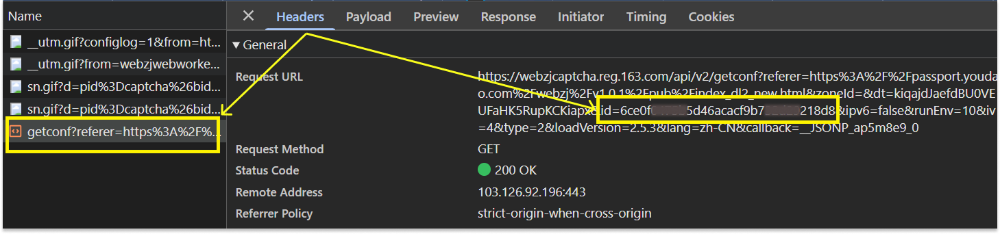

import Tabs from '@theme/Tabs';
import TabItem from '@theme/TabItem';
import ParamItem from '@theme/ParamItem';
import MethodItem from '@theme/MethodItem';
import MethodDescription from '@theme/MethodDescription'
import PriceBlock from '@theme/PriceBlock';
import PriceBlockWrap from '@theme/PriceBlockWrap';

# Yidun - 网易易盾验证码（NECaptcha）

<PriceBlockWrap>
  <PriceBlock title="Yidun task" name="yidunToken"/>
</PriceBlockWrap>


:::warning **注意！**
该任务将在我们的代理服务器上执行。
:::

## 请求参数

<TabItem value="proxy" label="YidunTask（使用代理）" className="bordered-panel">
  <ParamItem title="type" required type="string" />
  **YidunTask**

  ---

  <ParamItem title="websiteURL" required type="string" />
  包含验证码的页面完整 URL。

  ---

  <ParamItem title="websiteKey" required type="string" />
  页面中找到的 `siteKey` 参数的值（*见下方示例说明如何查找*）。

  ---

  <ParamItem title="userAgent" type="string" />
  浏览器的 User-Agent。<br />
  **请仅提供 Windows 系统中的有效 User-Agent，当前推荐的为**：userAgentPlaceholder

  ---

  <ParamItem title="proxyType" type="string" />
  **http** – 标准 HTTP/HTTPS 代理；<br />
  **https** – 如果 "http" 不工作，可以尝试此选项（某些自定义代理可能需要）；<br />
  **socks4** – SOCKS4 代理；<br />
  **socks5** – SOCKS5 代理。

  ---

  <ParamItem title="proxyAddress" type="string" />
  <p>
    代理服务器的 IPv4/IPv6 地址。请勿使用：
    - 主机名；
    - 透明代理（即能识别客户端 IP 的代理）；
    - 本地机器上的代理。
  </p>

  ---

  <ParamItem title="proxyPort" type="integer" />
  代理端口号。

  ---

  <ParamItem title="proxyLogin" type="string" />
  代理服务器的用户名。

  ---

  <ParamItem title="proxyPassword" type="string" />
  代理服务器的密码。

</TabItem>

### 如何获取 `websiteKey`
打开 *开发者工具*，点击验证码触发它，在 **Network** 网络请求标签中找到以 `get?referer=` 开头的请求，请求链接中的 *id* 参数值即为 `websiteKey`。



## 创建任务的方法

<Tabs className="full-width-tabs filled-tabs request-tabs" groupId="captcha-type">
  <TabItem value="proxyless" label="YidunTask（无需代理）" default className="method-panel">
    <MethodItem>
      ```http
      https://api.capmonster.cloud/createTask
      ```
    </MethodItem>
    <MethodDescription>

    **请求**
    ```json
    {
      "clientKey": "API_KEY",
      "task": {
        "type": "YidunTask",
        "websiteURL": "https://www.example.com",
        "websiteKey": "6cw0f0485d5d46auacf9b735d20218a5",
        "userAgent": "userAgentPlaceholder"
      }
    }
    ```

    **响应**
    ```json
    {
      "errorId": 0,
      "taskId": 407533077
    }
    ```
    </MethodDescription>
  </TabItem>

  <TabItem value="proxy" label="YidunTask（使用代理）" default className="method-panel">
    <MethodItem>
      ```http
      https://api.capmonster.cloud/createTask
      ```
    </MethodItem>
    <MethodDescription>

    **请求**
    ```json
    {
      "clientKey": "API_KEY",
      "task": {
        "type": "YidunTask",
        "websiteURL": "https://www.example.com",
        "websiteKey": "6cw0f0485d5d46auacf9b735d20218a5",
        "userAgent": "userAgentPlaceholder",
        "proxyType": "http",
        "proxyAddress": "8.8.8.8",
        "proxyPort": 8080,
        "proxyLogin": "proxyLoginHere",
        "proxyPassword": "proxyPasswordHere"
      }
    }
    ```

    **响应**
    ```json
    {
      "errorId": 0,
      "taskId": 407533077
    }
    ```
    </MethodDescription>
  </TabItem>
</Tabs>

## 获取任务结果的方法

使用方法 [getTaskResult](../api/methods/get-task-result.md) 获取 Yidun 验证码的解决结果。

<TabItem value="proxyless" label="CustomTask（无需代理）" default className="method-panel-full">
  <MethodItem>
    ```http
    https://api.capmonster.cloud/getTaskResult
    ```
  </MethodItem>
  <MethodDescription>

  **请求**
  ```json
  {
    "clientKey": "API_KEY",
    "taskId": 407533077
  }
  ```

  **响应**
  ```json
  {
    "errorId": 0,
    "errorCode": null,
    "errorDescription": null,
    "solution": {
      "token": "CN31_9AwsPmaYcJameP_09rA0vkVMQsPij...RXTlFJFc3"
    },
    "status": "ready"
  }
  ```
  </MethodDescription>
</TabItem>
