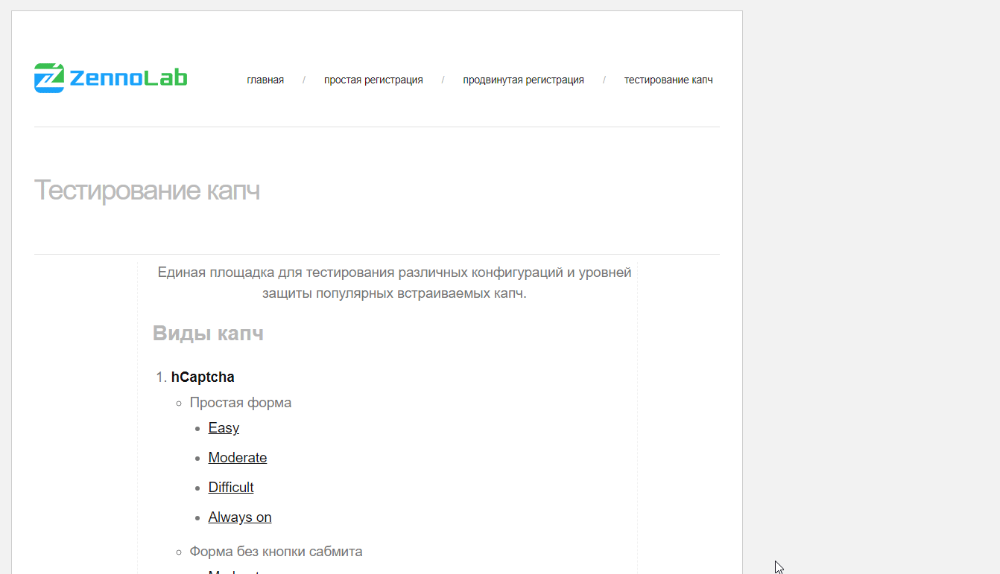

# 扩展中的自动提交

在解决验证码后，经常需要执行某些目标操作（例如点击按钮）。这有助于确认验证码已通过并继续与网站交互。  
CapMonster Cloud 扩展允许选择一个元素，在成功解决验证码后自动点击该元素。

## 自动提交元素的选择说明

1. 打开带有验证码的网站。  
2. 在需要在验证码解决后点击的按钮（或其他元素）上点击鼠标右键。  
3. 在弹出的菜单中选择 **CapMonster Cloud - 自动解验证码** → **标记为提交元素**。  
  

4. 随后页面上会显示提示消息 **自动提交元素**，并提供一个 **删除** 按钮用于移除自动提交的目标元素。  
  

5. 之后，当扩展在该页面成功解决验证码时，会自动点击之前选择的提交元素。  
  

## 自动提交的使用范围

目前，自动提交功能仅可在 **Google Chrome** 扩展中使用，并且仅适用于 **token 模式** 的验证码解决方式。  
支持自动提交的验证码类型包括：  

- ReCaptcha  
- GeeTest  
- Turnstile  
