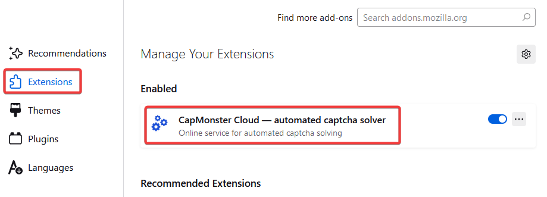
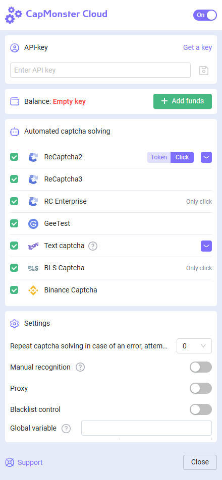

import { ArticleHead } from '../../../../../src/theme/ArticleHead';

<ArticleHead slug="extension/extension-firefox" />

# Firefox 浏览器扩展

## 描述
通过此扩展，您可以直接在浏览器中自动识别验证码。

该扩展适用于Mozilla Firefox浏览器。

-----
## 自动安装
1. 打开 [Firefox 插件商店](https://addons.mozilla.org/zh/firefox/addon/capmonster-cloud/)。
2. 点击 **Add to Firefox**。
3. 在模态窗口中点击 "Add" 按钮确认添加扩展。
   
   

要开始使用扩展，请点击地址栏右侧的扩展图标。前往 [设置页面](extension-firefox.mdx#设置)。

*如果因某些原因无法从 Firefox 插件商店安装扩展，请使用手动安装的说明。*

    
手动安装

1. 下载带有扩展的[存档文件](https://zenno.link/firefox-actual-build).

2. 打开 Firefox 浏览器并进入扩展管理：
   
   
3. 点击齿轮按钮，在打开的下拉列表中选择 "从文件安装附加组件..."
   
   
4. 选择已下载的带有扩展的存档文件。

5. 下载完扩展后，转到 "管理您的扩展程序" 并点击安装的扩展。
   
   
6. 进入 "权限" 选项卡，确保所有权限已被授予。
   

    
扩展程序的手动更新

如果您正在安装扩展的更新版本，那么在更新原始扩展文件后，您还需要在 "扩展" 页面上点击更新按钮（如何打开此页面在上面的 "手动安装" 部分已经描述）。

-----
## 设置

    
如何固定扩展

默认情况下，新安装的扩展会自动固定在浏览器面板上。

启动扩展后，您将看到此窗口：

### API 密钥
在相应的字段中输入 API 密钥(1)，点击保存按钮(2)。如果您输入了正确的密钥，您的余额将显示在下方(3)。

### 自动识别验证码
在这里，您可以选择扩展将自动识别的验证码类型。

:::info !

您可能需要重新加载带有验证码的页面以使更改生效！

:::
### 在出现错误时重复解决验证码
如果第一次尝试解决验证码失败，扩展将发送重复的任务，直到验证码解决成功，或者直到达到此设置中指定的限制为止。
### 代理

在这里，您可以指定将与识别任务一起发送的代理设置。

“登录”和“密码”是可选的。
### 黑名单控制
使用黑名单，您可以配置扩展程序在特定网站上忽略验证码。

启用此选项后，将会出现一个输入网站的字段：

域名必须与协议（https:// 或 http://） 一起指定。
您可以使用通配符：

- ? - 代表除句点以外的任何字符
- \* - 代表任意数量的任意字符

示例：

|**过滤器**|**描述**|
| :-: | :-: |
|`https://zennolab.com`|禁止在 `https://zennolab.com` 网站上使用扩展|
|`https://*.zennolab.com`|禁止在所有子域名 `https://zennolab.com` 上使用扩展|
|`https://www.google.*`|禁止在所有 Google 域名下（ru、com、com.ua 等）使用扩展|

当解决验证码时出现错误，请参阅[错误术语表](/api/api-errors.mdx)。

## 验证码参数映射

**CapMonster Cloud** 扩展程序提供了一种便捷方式，可用于查看各种验证码类型所需的参数，从而正确发送至服务器并成功完成识别。所显示的数据有助于确认所传参数的准确性，并可作为构建 API 请求的示例。

### 支持的验证码类型及其参数

| 验证码类型                       | 显示的参数                                                                                                       |
| --------------------------- | ----------------------------------------------------------------------------------------------------------- |
| **reCAPTCHA V2**            | `class`，`imageUrls`，`Task`（在 `metadata` 中），`Grid`（在 `metadata` 中），`recognizingThreshold`，`userAgent`，`type` |
| **reCAPTCHA V2 Invisible**  | `class`，`imageUrls`，`Task`（在 `metadata` 中），`Grid`（在 `metadata` 中），`recognizingThreshold`，`userAgent`，`type` |
| **reCAPTCHA V2 Enterprise** | `class`，`imageUrls`，`Task`（在 `metadata` 中），`Grid`（在 `metadata` 中），`recognizingThreshold`，`userAgent`，`type` |
| **reCAPTCHA V3**            | `websiteURL`，`websiteKey`，`pageAction`，`minScore`，`type`                                                    |
| **GeeTest v3**              | `websiteURL`，`gt`，`challenge`，`userAgent`，`type`                                                            |
| **GeeTest v4**              | `websiteURL`，`gt`（`captcha_id`），`userAgent`，`version`，`type`                                                |
| **Cloudflare Turnstile**    | `websiteURL`，`websiteKey`，`userAgent`，`type`                                                                |
| **Cloudflare Challenge**    | `websiteURL`，`websiteKey`，`userAgent`，`pageAction`，`data`，`pageData`，`cloudflareTaskType`，`type`            |
| **ImageToText**             | `body`（`base64` 格式），`type`                                                                                  |
| **BLS**                     | `class`，`imagesBase64`，`Task`（在 `metadata` 中），`TaskArgument`（在 `metadata` 中），`type`                         |
| **Binance**                 | `websiteURL`，`websiteKey`，`validateId`，`userAgent`，`type`                                                   |

使用该功能，请启用扩展程序，打开验证码页面（确保验证码类型受支持并已选中进行解决），然后按照以下步骤操作：

1. 打开开发者工具（DevTools），进入 **CapMonster Cloud** 选项卡： 
    
   

2. 刷新页面。

所选验证码的参数将自动显示： 
 
