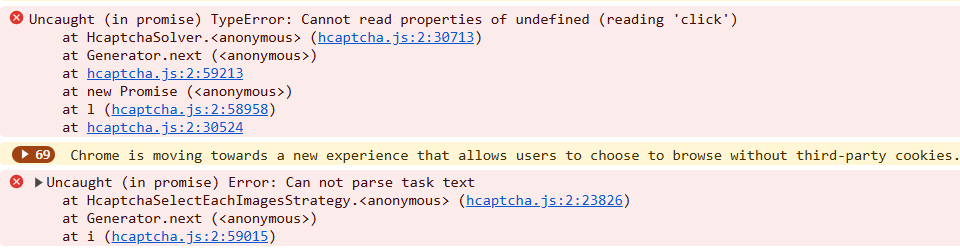

# 已知问题


<details>
        <summary>store.steampowered.com</summary>

我们的服务仅能解决英文验证码；在该网站上，验证码语言的确定不是来自系统设置，而是来自网站上选择的语言，因此为了正确解决问题，请务必选择英文。

</details>

<details>
        <summary>错误 'Uncaught (in promise) TypeError: Cannot read properties of undefined (reading 'click')'</summary>

如果在通过 CapMonster Cloud 扩展使用点击方法 (ComplexImageTask) 解验证码时出现错误 'Uncaught (in promise) TypeError: Cannot read properties of undefined (reading 'click')'，如截图所示，建议在扩展中设置 'Delay between click' 值 —— 这可能有助于解决问题。

</details>

<details>
  <summary>扩展程序未响应 Cloudflare Turnstile</summary>

## 通过 Shadow DOM 访问 `websiteKey`  

有时验证码的密钥 (**`websiteKey`**) 隐藏在 *closed* 模式的 `shadow-root` 中。  
例如，在以下 iframe 地址中：  
`https://challenges.cloudflare.com/cdn-cgi/challenge-platform/h/g/turnstile/if/.../0x4AAAAAAA1a2345abc-/auto/...`

此时，`websiteKey` 的值是 *0x4AAAAAAA1a2345abc*。  

如果扩展程序在该 iframe **之前**加载，则可以将 `shadowRoot` 设置为开放模式并提取 `websiteKey`。  
如果 iframe 已经加载，则无法获取该密钥。

作为测试和调试的替代方案，可以使用 **Selenium**（或其他无头浏览器），并在必要时与扩展程序一起运行。

---

## 示例：通过 Selenium 打开 `shadowRoot`

```python
from selenium import webdriver
from selenium.webdriver.common.by import By
import time

# WebDriver 配置
options = webdriver.ChromeOptions()
driver = webdriver.Chrome(options=options)

# 打开页面
driver.get("https://example.com")

# 注入 JavaScript 以打开 ShadowRoot
inject_script = """
const originalAttachShadow = Element.prototype.attachShadow;
Element.prototype.attachShadow = function(...args) {
    if (args[0] && args[0].mode === 'closed') {
        args[0].mode = 'open';
    }
    const shadowRoot = originalAttachShadow.apply(this, args);
    return shadowRoot;
};
console.log('ShadowRoot mode changed to open.');
"""
driver.execute_script(inject_script)

# 等待页面加载
time.sleep(3)

# 在修改 attachShadow 后与 shadow DOM 交互的示例
shadow_host = driver.find_element(By.CSS_SELECTOR, "shadow-host-selector")  # 请指定实际选择器
shadow_root = driver.execute_script("return arguments[0].shadowRoot", shadow_host)

# 与 shadow DOM 中的元素交互
button = shadow_root.find_element(By.CSS_SELECTOR, "button")
button.click()

# 关闭浏览器
driver.quit()
```
如果要在使用扩展程序的同时使用 Selenium，请在启动浏览器时加载扩展程序：

```python
options = webdriver.ChromeOptions()
options.add_extension('your_extension.crx')  # 扩展程序的路径
driver = webdriver.Chrome(options=options)
```
如何下载 CRX 文件，请参阅 [此处。](https://zennolab.atlassian.net/wiki/spaces/EN/pages/2082930692/Works+with+Extensions#How-to-download-browser-extension-as-a-.crx-file)

</details>
