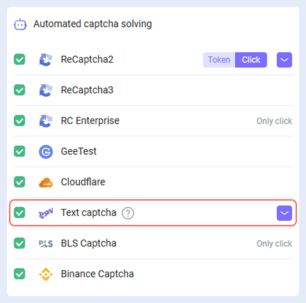
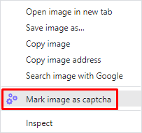

import { ArticleHead } from '../../../../../src/theme/ArticleHead';

<ArticleHead slug="extension/text-captcha-solve" />

# 解决文本验证码
## 描述
我们在浏览器扩展中增加了识别文本验证码的功能。

## 工作原理
### 浏览器中的操作
1\.在验证码上右键，从弹出菜单中选择“Mark image as captcha”。

2\. 在打开的菜单中，右键点击答案输入字段，并选择“Select an input for the captcha result”。

3\.结果将自动填写到答案输入字段中。

### 使用软件自动化识别
要在浏览器中自动化识别文本验证码的过程（例如使用 *开发者工具* 或 *Selenium*），您需要：
1. 将 `cm-image-to-text-source="id"` 属性分配给包含图像的元素：

2. 将 `cm-image-to-text-input-result="id"` 属性分配给包含输入字段的元素：

其中 "id" 是验证码标识符（任意值）。
:::info 信息
同时，相互对应的验证码和输入字段应具有相同的 id。

您可以同时在页面上解决多个验证码，关键是在同一组内 id 是唯一的，并且验证码和输入字段的 id 相互匹配。
:::

## 如果文字验证码识别不正确该怎么办

如果文字验证码通过扩展程序识别错误，请按照以下步骤操作：

1. 从可用列表中选择合适的模块（参见 [模块名称传递](/docs/api/module-name)）。
2. 如果没有所需的模块，请创建自己的模块（参见 [创建用户模块](/docs/api/user-module)），并等待其准备就绪。
3. 在扩展程序中打开 **Text captcha** → **Settings**（紫色带箭头的按钮）。

4. 输入模块名称并点击 **+ Add Module**。

这样验证码将通过所选或自定义模块正确识别。

