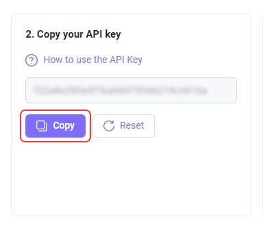

# 通过其他服务的API进行验证码识别
CapMonster Cloud支持API：Anti-Captcha（v1.0，v2.0）、RuCaptcha、RipCaptcha、2Captcha、BypassCaptcha、DeathByCaptcha。因此，即使您的程序未与我们的服务集成，您也可以通过CapMonster Cloud解决验证码问题。

您只需安装 [**CapMonsterInterceptor**](https://static.zenno.services/ccl/interceptor.msi)（适用于Windows操作系统）
 其他平台的支持正在开发中。

在安装过程中，您需要指定您帐户中的API密钥，您可以在您的[个人区域](https://capmonster.cloud/Dashboard)找到。

安装完成后，桌面上将创建一个CapMonsterInterceptor的快捷方式。启动后，该程序将出现在系统托盘中。无需进行任何设置。

当CapMonsterInterceptor运行时，发送到*Anti-Captcha（v1.0，v2.0）、RuCaptcha、RipCaptcha、2Captcha、BypassCaptcha、DeathByCaptcha*服务进行识别的所有验证码将被拦截并重定向到CapMonster Cloud。
## 示例
只需在您的程序中选择需要输入验证码的识别服务之一。在我们的示例中，将选择 *DeathByCaptcha*。

- **关于DeathByCaptcha的注意事项**，用于识别用户的DeathByCaptcha API使用用户名和密码，而不是API密钥。在这种情况下，您需要填写两个字段，可以填写随机值。

输入任意API密钥（例如，qwerty）。

现在您可以运行您的程序了。所有发送到另一个服务（例如我们的示例中的DeathByCaptcha）的验证码将被拦截并发送到CapMonster Cloud。

双击系统托盘中的CapMonsterInterceptor图标，您可以查看发送到识别的拦截验证码的统计信息。

## 问题与答案

如何在安装CapMonsterInterceptor时更改指定的API密钥？

双击CapMonsterInterceptor系统托盘图标。在程序窗口中，找到“设置”区块，更改密钥并点击“保存”。

如果出现错误：“尝试使用访问权限禁止的方法访问套接字”该怎么办？

如果在启动过程中出现错误，意味着端口 80 和/或 443 被另一个应用程序占用。

要解决此错误，需要结束占用这些端口的进程。

通过开始菜单 → 搜索 → cmd 打开命令行。

输入命令 netstat -a -o | findstr :443

***-a*** 参数表示我们对所有活动连接感兴趣，***-o*** 参数表示我们需要显示每个连接的进程ID。
**findstr :443** 将显示占用所需端口的进程。

进程的PID将显示在右侧列中，如截图所示。
请记住或写下该PID。

打开任务管理器，切换到“详细信息”选项卡，找到具有相应ID的进程并结束该任务。

