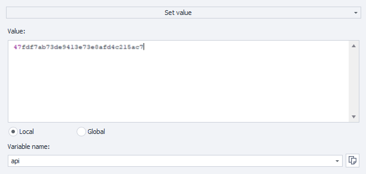
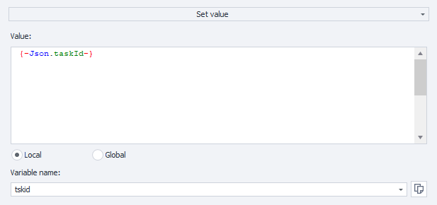

---

sidebar\_position: 0

# id: my-home-doc

# slug: /

---

# 入门指南

本章节包含服务入门说明，以及发送验证码和识别验证码的主要方法介绍。

## 第一步：创建账号

在开始解决验证码之前，请先以您方便的方式注册 [CapMonster Cloud](https://capmonster.cloud/)。然后进入[个人控制面板](https://capmonster.cloud/Dashboard)，您将在这里找到所有必要的信息——当前余额、API 密钥，以及成功和未成功解决任务的统计数据。


## 第二步：充值余额

服务支持多种充值方式。


现在您可以通过[浏览器扩展](https://docs.capmonster.cloud/docs/extension)自动解决验证码，或者通过 API 创建任务。

## 发送请求和获取结果的方法

\:::info 接口地址

```http
https://api.capmonster.cloud
```
:::
请求格式：`JSON POST`。
响应格式始终为 `JSON`。
:::

**要解决验证码，您需要：**

1. 通过[createTask](api/methods/create-task.md)方法创建验证码任务。
2. 等待一段时间。根据系统负载，响应时间在 300ms 到 6s 之间。
3. 通过[getTaskResult](api/methods/get-task-result.md)方法请求验证码结果。如果验证码尚未解决，返回步骤 2。

额外方法：

* [查询](api/methods/get-balance.md)账户当前余额。

### 代码示例

为方便您快速集成 CapMonster.Cloud API，我们准备了多种语言的客户端库。以市场最低价格识别各种验证码！

| **语言** | **仓库链接**                                                                                                                                                 |
| :----- | :------------------------------------------------------------------------------------------------------------------------------------------------------- |
| C#     | - [Nuget](https://www.nuget.org/packages/Zennolab.CapMonsterCloud.Client)<br /> - [Github](https://github.com/ZennoLab/capmonstercloud-client-dotnet)    |
| Python | - [PyPl](https://pypi.org/project/capmonstercloudclient/)<br /> - [Github](https://github.com/ZennoLab/capmonstercloud-client-python)                    |
| JS     | - [Npm](https://www.npmjs.com/package/@zennolab_com/capmonstercloud-client)<br /> - [Github](https://github.com/ZennoLab/capmonstercloud-client-js)      |
| GO     | - [Pkg.go.dev](https://pkg.go.dev/github.com/ZennoLab/capmonstercloud-client-go)<br /> - [Github](https://github.com/ZennoLab/capmonstercloud-client-go) |
| PHP    | - [Packagist](https://packagist.org/packages/zennolab/capmonstercloud.client)<br /> - [Github](https://github.com/ZennoLab/capmonstercloud-client-php)   |

## 验证码识别方法

### 1. 通过 Token

这是基础的验证码识别方法，您需要：

* 手动查找页面中的参数，例如：

  * `sitekey`（或 `websiteKey`）— 验证码唯一标识符；
  * `websiteURL` — 验证码所在页面的网址；
* 分析 JavaScript 代码和网络请求以获取这些数据；
* 发送任务到 CapMonster Cloud 并传入所需参数；
* 获得响应的 **token** — 唯一确认验证码通过的代码；
* 执行 **自动提交（autosubmit）** — 将 token 发送回网站以确认验证码通过。

> 适合愿意手动分析代码并构建提交逻辑的开发者。

---

### 2. 通过点击

模拟用户操作（鼠标移动、点击、图像选择）的方法，通过官方浏览器扩展使用，无需：

* 手动查找 `sitekey` 或其他参数；
* 分析 HTML 或 JavaScript；
* 实现自动提交机制。

该方法适用于：

* 网站采用非标准验证码实现；
* 参数被加密或动态注入；
* 提交功能隐藏在深层脚本中。

> 适合复杂场景及无编程经验的用户。

---

两种方法均使用 CapMonster Cloud 识别验证码，但配置复杂度不同。
方法选择依赖于具体网站和用户技能水平。

另外，您也可以在 [ZennoPoster](https://zennolab.com/en/products/zennoposter/) 中使用点击法。只需安装我们的 CapMonster Cloud 扩展（参见章节 [在 ProjectMaker 浏览器中安装 CapMonster Cloud 扩展的说明](extension/install-instruction.md)），在基于 Chromium 的项目中输入 API 密钥，并像在 Chrome 浏览器中一样使用该扩展。

## ZennoPoster 中提交 Token 示例

使用动作：

1. 在 ProjectMaker 集成 CapMonster Cloud（“设置” - “验证码” - 选择 CapMonster Cloud 模块，输入您的 API 密钥）；

2. 添加动作“清除 Cookie” - “打开页面”（例如 reCaptcha v.2 – [https://lessons.zennolab.com/captchas/recaptcha/v2\_simple.php?level=high](https://lessons.zennolab.com/captchas/recaptcha/v2_simple.php?level=high)）- “识别 ReCaptcha”；

3. 在“识别 ReCaptcha”动作属性中，选择模块 CapMonsterCloud.dll，指定验证码类型（reCaptcha v.2）及识别方式（**标签页内** 或 **通过 sitekey**）：


4. 选择 **通过 sitekey** 时，填写验证码数据（sitekey）和需要识别验证码的页面 URL：


### reCaptcha v.3

1. 添加动作“清除 Cookie” - “打开页面”（例如 [https://lessons.zennolab.com/captchas/recaptcha/v3.php?level=beta](https://lessons.zennolab.com/captchas/recaptcha/v3.php?level=beta)）- “识别 ReCaptcha”；

2. 在动作属性中选择模块 CapMonsterCloud.dll，指定验证码类型（reCaptcha v.3）、识别方式（标签页内或通过 Sitekey），并填写 Action 和 minScore：


<!-- ### hCaptcha

1. 在已有页面导航到验证码页面的项目中，添加“识别 hCaptcha”动作；

2. 在动作属性中选择识别方式（标签页内或通过 Sitekey），通过 Sitekey 时需填写 sitekey 和验证码所在 URL：

 -->

### 通过 HTTP 请求

对于 ProjectMaker 没有现成动作的某些验证码类型，您需要使用扩展或自行构造请求进行识别。

1. “变量处理”（“添加动作” - “数据” - “变量处理”），属性中选择“设置值”，输入您的 CapMonster Cloud API 密钥：



2. “添加动作” - “HTTP” - “POST 请求”（如果需要，可添加代理参数）：


3. 添加“JSON/XML 处理”动作（“添加动作” - “数据” - “JSON/XML 处理”），属性选择“解析”，类型选“Json”，文本右键选择“从变量设置值”：


4. 添加“变量处理”动作，设置值为 `{-Json.taskId-}`：



5. 构造新 POST 请求以获取结果：


6. 在“JSON/XML 处理”动作中添加“解析”：


7. 解析完毕后，依据页面源码，使用“设置值”动作将 token 填入验证码对应表单：


## 视频教程：通过 API 和 ZennoPoster 解决验证码

本视频展示了如何使用 CapMonster Cloud 通过 API 和 [ZennoPoster](https://zennolab.com/en/products/zennoposter/) 解决验证码，并提供快速配置和高效使用服务的实用技巧。 <video width="100%" height="400" controls> <source src="/videos/Capmonster Cloud-ZH.mp4" type="video/mp4" />
您的浏览器不支持视频播放。 </video>
